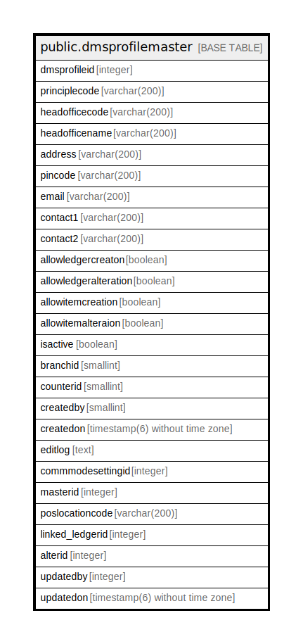

# public.dmsprofilemaster

## Description

## Columns

| Name | Type | Default | Nullable | Children | Parents | Comment |
| ---- | ---- | ------- | -------- | -------- | ------- | ------- |
| dmsprofileid | integer | nextval('dmsprofilemaster_dmsprofileid_seq'::regclass) | false |  |  |  |
| principlecode | varchar(200) |  | true |  |  |  |
| headofficecode | varchar(200) |  | true |  |  |  |
| headofficename | varchar(200) |  | true |  |  |  |
| address | varchar(200) |  | true |  |  |  |
| pincode | varchar(200) |  | true |  |  |  |
| email | varchar(200) |  | true |  |  |  |
| contact1 | varchar(200) |  | true |  |  |  |
| contact2 | varchar(200) |  | true |  |  |  |
| allowledgercreaton | boolean |  | true |  |  |  |
| allowledgeralteration | boolean |  | true |  |  |  |
| allowitemcreation | boolean |  | true |  |  |  |
| allowitemalteraion | boolean |  | true |  |  |  |
| isactive | boolean |  | true |  |  |  |
| branchid | smallint |  | true |  |  |  |
| counterid | smallint |  | true |  |  |  |
| createdby | smallint |  | true |  |  |  |
| createdon | timestamp(6) without time zone |  | true |  |  |  |
| editlog | text |  | true |  |  |  |
| commmodesettingid | integer |  | true |  |  |  |
| masterid | integer |  | true |  |  |  |
| poslocationcode | varchar(200) |  | true |  |  |  |
| linked_ledgerid | integer |  | true |  |  |  |
| alterid | integer |  | true |  |  |  |
| updatedby | integer |  | true |  |  |  |
| updatedon | timestamp(6) without time zone | NULL::timestamp without time zone | true |  |  |  |

## Constraints

| Name | Type | Definition |
| ---- | ---- | ---------- |
| dmsprofilemaster_pkey | PRIMARY KEY | PRIMARY KEY (dmsprofileid) |

## Indexes

| Name | Definition |
| ---- | ---------- |
| dmsprofilemaster_pkey | CREATE UNIQUE INDEX dmsprofilemaster_pkey ON public.dmsprofilemaster USING btree (dmsprofileid) |

## Triggers

| Name | Definition |
| ---- | ---------- |
| update_alter_id | CREATE TRIGGER update_alter_id AFTER INSERT OR UPDATE ON public.dmsprofilemaster FOR EACH ROW EXECUTE FUNCTION updatealterid() |

## Relations

---

> Generated by [tbls](https://github.com/k1LoW/tbls)
