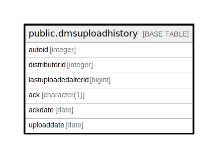

# public.dmsuploadhistory

## Description

## Columns

| Name | Type | Default | Nullable | Children | Parents | Comment |
| ---- | ---- | ------- | -------- | -------- | ------- | ------- |
| autoid | integer | nextval('dmsuploadhistory_autoid_seq'::regclass) | false |  |  |  |
| distributorid | integer |  | true |  |  |  |
| lastuploadedalterid | bigint |  | true |  |  |  |
| ack | character(1) |  | true |  |  |  |
| ackdate | date |  | true |  |  |  |
| uploaddate | date |  | true |  |  |  |

## Constraints

| Name | Type | Definition |
| ---- | ---- | ---------- |
| dmsuploadhistory_pkey | PRIMARY KEY | PRIMARY KEY (autoid) |

## Indexes

| Name | Definition |
| ---- | ---------- |
| dmsuploadhistory_pkey | CREATE UNIQUE INDEX dmsuploadhistory_pkey ON public.dmsuploadhistory USING btree (autoid) |

## Relations

---

> Generated by [tbls](https://github.com/k1LoW/tbls)
