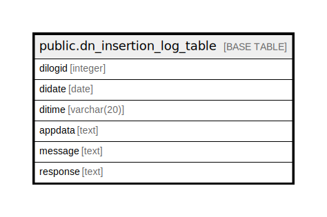

# public.dn_insertion_log_table

## Description

## Columns

| Name | Type | Default | Nullable | Children | Parents | Comment |
| ---- | ---- | ------- | -------- | -------- | ------- | ------- |
| dilogid | integer | nextval('dn_insertion_log_table_dilogid_seq'::regclass) | false |  |  |  |
| didate | date |  | true |  |  |  |
| ditime | varchar(20) |  | true |  |  |  |
| appdata | text |  | true |  |  |  |
| message | text |  | true |  |  |  |
| response | text |  | true |  |  |  |

## Constraints

| Name | Type | Definition |
| ---- | ---- | ---------- |
| pk_dn_insertion_log_table | PRIMARY KEY | PRIMARY KEY (dilogid) |

## Indexes

| Name | Definition |
| ---- | ---------- |
| pk_dn_insertion_log_table | CREATE UNIQUE INDEX pk_dn_insertion_log_table ON public.dn_insertion_log_table USING btree (dilogid) |

## Triggers

| Name | Definition |
| ---- | ---------- |
| trg_clear_log | CREATE TRIGGER trg_clear_log AFTER INSERT OR UPDATE ON public.dn_insertion_log_table FOR EACH ROW EXECUTE FUNCTION clear_log() |

## Relations

---

> Generated by [tbls](https://github.com/k1LoW/tbls)
