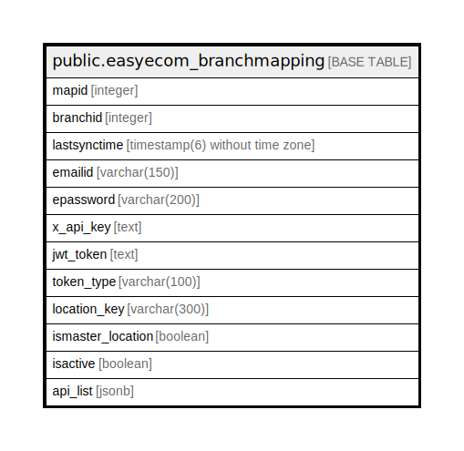

# public.easyecom_branchmapping

## Description

## Columns

| Name | Type | Default | Nullable | Children | Parents | Comment |
| ---- | ---- | ------- | -------- | -------- | ------- | ------- |
| mapid | integer | nextval('easyecom_branchmapping_mapid_seq'::regclass) | false |  |  |  |
| branchid | integer |  | true |  |  |  |
| lastsynctime | timestamp(6) without time zone |  | true |  |  |  |
| emailid | varchar(150) |  | true |  |  |  |
| epassword | varchar(200) |  | true |  |  |  |
| x_api_key | text |  | true |  |  |  |
| jwt_token | text |  | true |  |  |  |
| token_type | varchar(100) |  | true |  |  |  |
| location_key | varchar(300) |  | true |  |  |  |
| ismaster_location | boolean | false | true |  |  |  |
| isactive | boolean | false | true |  |  |  |
| api_list | jsonb |  | true |  |  |  |

## Constraints

| Name | Type | Definition |
| ---- | ---- | ---------- |
| easyecom_branchmapping_pkey | PRIMARY KEY | PRIMARY KEY (mapid) |
| easyecom_branchmapping_unique | UNIQUE | UNIQUE (branchid) |

## Indexes

| Name | Definition |
| ---- | ---------- |
| easyecom_branchmapping_pkey | CREATE UNIQUE INDEX easyecom_branchmapping_pkey ON public.easyecom_branchmapping USING btree (mapid) |
| easyecom_branchmapping_unique | CREATE UNIQUE INDEX easyecom_branchmapping_unique ON public.easyecom_branchmapping USING btree (branchid) |

## Relations

---

> Generated by [tbls](https://github.com/k1LoW/tbls)
