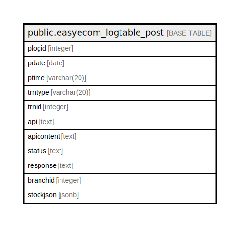

# public.easyecom_logtable_post

## Description

## Columns

| Name | Type | Default | Nullable | Children | Parents | Comment |
| ---- | ---- | ------- | -------- | -------- | ------- | ------- |
| plogid | integer | nextval('easyecom_logtable_post_plogid_seq'::regclass) | false |  |  |  |
| pdate | date |  | true |  |  |  |
| ptime | varchar(20) |  | true |  |  |  |
| trntype | varchar(20) |  | true |  |  |  |
| trnid | integer |  | true |  |  |  |
| api | text |  | true |  |  |  |
| apicontent | text |  | true |  |  |  |
| status | text |  | true |  |  |  |
| response | text |  | true |  |  |  |
| branchid | integer | 0 | true |  |  |  |
| stockjson | jsonb |  | true |  |  |  |

## Constraints

| Name | Type | Definition |
| ---- | ---- | ---------- |
| easyecom_logtable_post_pkey | PRIMARY KEY | PRIMARY KEY (plogid) |

## Indexes

| Name | Definition |
| ---- | ---------- |
| easyecom_logtable_post_pkey | CREATE UNIQUE INDEX easyecom_logtable_post_pkey ON public.easyecom_logtable_post USING btree (plogid) |

## Triggers

| Name | Definition |
| ---- | ---------- |
| trg_clear_log | CREATE TRIGGER trg_clear_log AFTER INSERT OR UPDATE ON public.easyecom_logtable_post FOR EACH ROW EXECUTE FUNCTION clear_log() |

## Relations

---

> Generated by [tbls](https://github.com/k1LoW/tbls)
