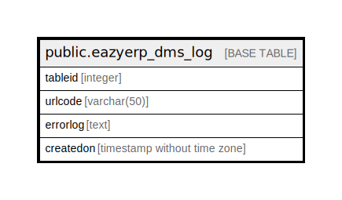

# public.eazyerp_dms_log

## Description

## Columns

| Name | Type | Default | Nullable | Children | Parents | Comment |
| ---- | ---- | ------- | -------- | -------- | ------- | ------- |
| tableid | integer | nextval('eazyerp_dms_log_tableid_seq'::regclass) | false |  |  |  |
| urlcode | varchar(50) |  | true |  |  |  |
| errorlog | text |  | true |  |  |  |
| createdon | timestamp without time zone | now() | true |  |  |  |

## Constraints

| Name | Type | Definition |
| ---- | ---- | ---------- |
| eazyerp_dms_log_pkey | PRIMARY KEY | PRIMARY KEY (tableid) |

## Indexes

| Name | Definition |
| ---- | ---------- |
| eazyerp_dms_log_pkey | CREATE UNIQUE INDEX eazyerp_dms_log_pkey ON public.eazyerp_dms_log USING btree (tableid) |

## Relations

---

> Generated by [tbls](https://github.com/k1LoW/tbls)
