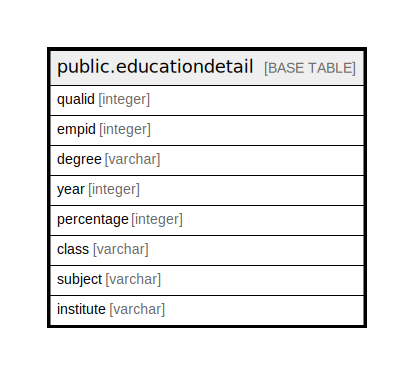

# public.educationdetail

## Description

## Columns

| Name | Type | Default | Nullable | Children | Parents | Comment |
| ---- | ---- | ------- | -------- | -------- | ------- | ------- |
| qualid | integer | nextval('educationdetail_qualid_seq'::regclass) | false |  |  |  |
| empid | integer |  | true |  |  |  |
| degree | varchar |  | true |  |  |  |
| year | integer |  | true |  |  |  |
| percentage | integer |  | true |  |  |  |
| class | varchar |  | true |  |  |  |
| subject | varchar |  | true |  |  |  |
| institute | varchar |  | true |  |  |  |

## Relations

---

> Generated by [tbls](https://github.com/k1LoW/tbls)
