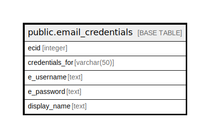

# public.email_credentials

## Description

## Columns

| Name | Type | Default | Nullable | Children | Parents | Comment |
| ---- | ---- | ------- | -------- | -------- | ------- | ------- |
| ecid | integer | nextval('email_credentials_ecid_seq'::regclass) | false |  |  |  |
| credentials_for | varchar(50) |  | true |  |  |  |
| e_username | text |  | true |  |  |  |
| e_password | text |  | true |  |  |  |
| display_name | text |  | true |  |  |  |

## Constraints

| Name | Type | Definition |
| ---- | ---- | ---------- |
| pk_email_credentials | PRIMARY KEY | PRIMARY KEY (ecid) |

## Indexes

| Name | Definition |
| ---- | ---------- |
| pk_email_credentials | CREATE UNIQUE INDEX pk_email_credentials ON public.email_credentials USING btree (ecid) |

## Relations

---

> Generated by [tbls](https://github.com/k1LoW/tbls)
