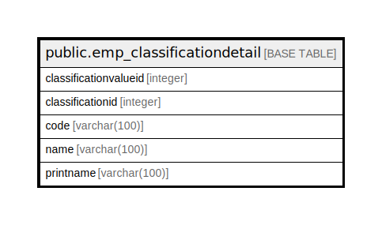

# public.emp_classificationdetail

## Description

## Columns

| Name | Type | Default | Nullable | Children | Parents | Comment |
| ---- | ---- | ------- | -------- | -------- | ------- | ------- |
| classificationvalueid | integer | nextval('emp_classificationdetail_classificationvalueid_seq'::regclass) | false |  |  |  |
| classificationid | integer |  | false |  |  |  |
| code | varchar(100) |  | true |  |  |  |
| name | varchar(100) |  | true |  |  |  |
| printname | varchar(100) |  | true |  |  |  |

## Constraints

| Name | Type | Definition |
| ---- | ---- | ---------- |
| pay_classificationdetail_pkey | PRIMARY KEY | PRIMARY KEY (classificationvalueid) |

## Indexes

| Name | Definition |
| ---- | ---------- |
| pay_classificationdetail_pkey | CREATE UNIQUE INDEX pay_classificationdetail_pkey ON public.emp_classificationdetail USING btree (classificationvalueid) |

## Relations

---

> Generated by [tbls](https://github.com/k1LoW/tbls)
