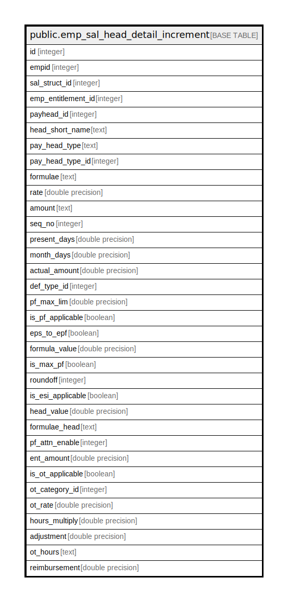

# public.emp_sal_head_detail_increment

## Description

## Columns

| Name | Type | Default | Nullable | Children | Parents | Comment |
| ---- | ---- | ------- | -------- | -------- | ------- | ------- |
| id | integer | nextval('emp_sal_head_detail_increment_id_seq'::regclass) | false |  |  |  |
| empid | integer |  | false |  |  |  |
| sal_struct_id | integer |  | false |  |  |  |
| emp_entitlement_id | integer |  | true |  |  |  |
| payhead_id | integer |  | false |  |  |  |
| head_short_name | text |  | true |  |  |  |
| pay_head_type | text |  | false |  |  |  |
| pay_head_type_id | integer |  | true |  |  |  |
| formulae | text |  | true |  |  |  |
| rate | double precision |  | true |  |  |  |
| amount | text |  | true |  |  |  |
| seq_no | integer |  | true |  |  |  |
| present_days | double precision |  | true |  |  |  |
| month_days | double precision |  | true |  |  |  |
| actual_amount | double precision |  | true |  |  |  |
| def_type_id | integer |  | true |  |  |  |
| pf_max_lim | double precision |  | true |  |  |  |
| is_pf_applicable | boolean |  | true |  |  |  |
| eps_to_epf | boolean |  | true |  |  |  |
| formula_value | double precision |  | true |  |  |  |
| is_max_pf | boolean |  | true |  |  |  |
| roundoff | integer |  | true |  |  |  |
| is_esi_applicable | boolean |  | true |  |  |  |
| head_value | double precision |  | true |  |  |  |
| formulae_head | text |  | true |  |  |  |
| pf_attn_enable | integer |  | true |  |  |  |
| ent_amount | double precision |  | true |  |  |  |
| is_ot_applicable | boolean |  | true |  |  |  |
| ot_category_id | integer |  | true |  |  |  |
| ot_rate | double precision |  | true |  |  |  |
| hours_multiply | double precision |  | true |  |  |  |
| adjustment | double precision |  | true |  |  |  |
| ot_hours | text |  | true |  |  |  |
| reimbursement | double precision |  | true |  |  |  |

## Constraints

| Name | Type | Definition |
| ---- | ---- | ---------- |
| emp_sal_head_detail_increment_pkey | PRIMARY KEY | PRIMARY KEY (id) |

## Indexes

| Name | Definition |
| ---- | ---------- |
| emp_sal_head_detail_increment_pkey | CREATE UNIQUE INDEX emp_sal_head_detail_increment_pkey ON public.emp_sal_head_detail_increment USING btree (id) |

## Relations

---

> Generated by [tbls](https://github.com/k1LoW/tbls)
