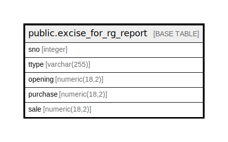

# public.excise_for_rg_report

## Description

## Columns

| Name | Type | Default | Nullable | Children | Parents | Comment |
| ---- | ---- | ------- | -------- | -------- | ------- | ------- |
| sno | integer |  | false |  |  |  |
| ttype | varchar(255) |  | false |  |  |  |
| opening | numeric(18,2) |  | false |  |  |  |
| purchase | numeric(18,2) |  | false |  |  |  |
| sale | numeric(18,2) |  | false |  |  |  |

## Relations

---

> Generated by [tbls](https://github.com/k1LoW/tbls)
