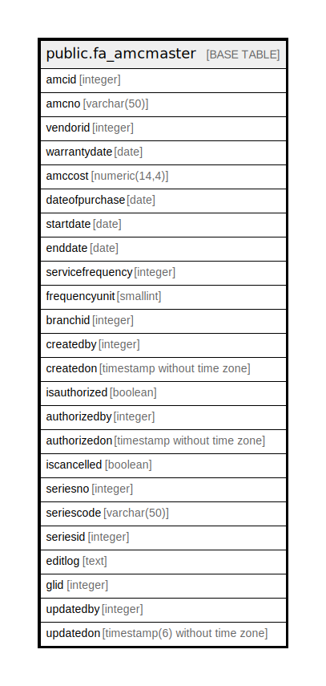

# public.fa_amcmaster

## Description

## Columns

| Name | Type | Default | Nullable | Children | Parents | Comment |
| ---- | ---- | ------- | -------- | -------- | ------- | ------- |
| amcid | integer | nextval('fa_amcmaster_amcid_seq'::regclass) | false |  |  |  |
| amcno | varchar(50) |  | true |  |  |  |
| vendorid | integer |  | true |  |  |  |
| warrantydate | date |  | true |  |  |  |
| amccost | numeric(14,4) |  | true |  |  |  |
| dateofpurchase | date |  | true |  |  |  |
| startdate | date |  | true |  |  |  |
| enddate | date |  | true |  |  |  |
| servicefrequency | integer |  | true |  |  |  |
| frequencyunit | smallint |  | true |  |  |  |
| branchid | integer |  | true |  |  |  |
| createdby | integer |  | true |  |  |  |
| createdon | timestamp without time zone |  | true |  |  |  |
| isauthorized | boolean | false | false |  |  |  |
| authorizedby | integer |  | true |  |  |  |
| authorizedon | timestamp without time zone |  | true |  |  |  |
| iscancelled | boolean | false | false |  |  |  |
| seriesno | integer |  | true |  |  |  |
| seriescode | varchar(50) | NULL::character varying | true |  |  |  |
| seriesid | integer |  | true |  |  |  |
| editlog | text |  | true |  |  |  |
| glid | integer |  | true |  |  |  |
| updatedby | integer |  | true |  |  |  |
| updatedon | timestamp(6) without time zone | NULL::timestamp without time zone | true |  |  |  |

## Constraints

| Name | Type | Definition |
| ---- | ---- | ---------- |
| fa_amcmaster_pkey | PRIMARY KEY | PRIMARY KEY (amcid) |

## Indexes

| Name | Definition |
| ---- | ---------- |
| fa_amcmaster_pkey | CREATE UNIQUE INDEX fa_amcmaster_pkey ON public.fa_amcmaster USING btree (amcid) |

## Relations

---

> Generated by [tbls](https://github.com/k1LoW/tbls)
