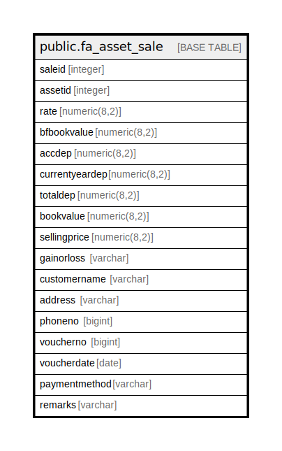

# public.fa_asset_sale

## Description

## Columns

| Name | Type | Default | Nullable | Children | Parents | Comment |
| ---- | ---- | ------- | -------- | -------- | ------- | ------- |
| saleid | integer | nextval('fa_asset_sale_saleid_seq'::regclass) | false |  |  |  |
| assetid | integer |  | true |  |  |  |
| rate | numeric(8,2) |  | true |  |  |  |
| bfbookvalue | numeric(8,2) |  | true |  |  |  |
| accdep | numeric(8,2) |  | true |  |  |  |
| currentyeardep | numeric(8,2) |  | true |  |  |  |
| totaldep | numeric(8,2) |  | true |  |  |  |
| bookvalue | numeric(8,2) |  | true |  |  |  |
| sellingprice | numeric(8,2) |  | true |  |  |  |
| gainorloss  | varchar |  | true |  |  |  |
| customername  | varchar |  | true |  |  |  |
| address  | varchar |  | true |  |  |  |
| phoneno  | bigint |  | true |  |  |  |
| voucherno  | bigint |  | true |  |  |  |
| voucherdate | date |  | true |  |  |  |
| paymentmethod | varchar |  | true |  |  |  |
| remarks | varchar |  | true |  |  |  |

## Constraints

| Name | Type | Definition |
| ---- | ---- | ---------- |
| fa_asset_sale_pkey | PRIMARY KEY | PRIMARY KEY (saleid) |

## Indexes

| Name | Definition |
| ---- | ---------- |
| fa_asset_sale_pkey | CREATE UNIQUE INDEX fa_asset_sale_pkey ON public.fa_asset_sale USING btree (saleid) |

## Relations

---

> Generated by [tbls](https://github.com/k1LoW/tbls)
