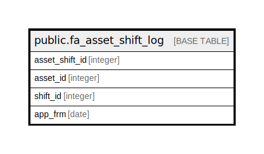

# public.fa_asset_shift_log

## Description

## Columns

| Name | Type | Default | Nullable | Children | Parents | Comment |
| ---- | ---- | ------- | -------- | -------- | ------- | ------- |
| asset_shift_id | integer | nextval('fa_asset_shift_log_asset_shift_id_seq'::regclass) | false |  |  |  |
| asset_id | integer |  | true |  |  |  |
| shift_id | integer |  | true |  |  |  |
| app_frm | date |  | true |  |  |  |

## Constraints

| Name | Type | Definition |
| ---- | ---- | ---------- |
| fa_asset_shift_log_pkey | PRIMARY KEY | PRIMARY KEY (asset_shift_id) |

## Indexes

| Name | Definition |
| ---- | ---------- |
| fa_asset_shift_log_pkey | CREATE UNIQUE INDEX fa_asset_shift_log_pkey ON public.fa_asset_shift_log USING btree (asset_shift_id) |

## Relations

---

> Generated by [tbls](https://github.com/k1LoW/tbls)
