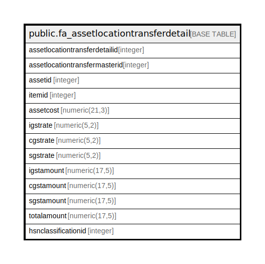

# public.fa_assetlocationtransferdetail

## Description

## Columns

| Name | Type | Default | Nullable | Children | Parents | Comment |
| ---- | ---- | ------- | -------- | -------- | ------- | ------- |
| assetlocationtransferdetailid | integer | nextval('fa_assetlocationtransferdetai_assetlocationtransferdetailid_seq'::regclass) | false |  |  |  |
| assetlocationtransfermasterid | integer |  | true |  |  |  |
| assetid | integer |  | true |  |  |  |
| itemid | integer |  | true |  |  |  |
| assetcost | numeric(21,3) |  | true |  |  |  |
| igstrate | numeric(5,2) |  | true |  |  |  |
| cgstrate | numeric(5,2) |  | true |  |  |  |
| sgstrate | numeric(5,2) |  | true |  |  |  |
| igstamount | numeric(17,5) | 0 | true |  |  |  |
| cgstamount | numeric(17,5) | 0 | true |  |  |  |
| sgstamount | numeric(17,5) | 0 | true |  |  |  |
| totalamount | numeric(17,5) | 0 | true |  |  |  |
| hsnclassificationid | integer | 0 | true |  |  |  |

## Constraints

| Name | Type | Definition |
| ---- | ---- | ---------- |
| fa_assetlocationtransferdetail_pkey | PRIMARY KEY | PRIMARY KEY (assetlocationtransferdetailid) |

## Indexes

| Name | Definition |
| ---- | ---------- |
| fa_assetlocationtransferdetail_pkey | CREATE UNIQUE INDEX fa_assetlocationtransferdetail_pkey ON public.fa_assetlocationtransferdetail USING btree (assetlocationtransferdetailid) |

## Relations

---

> Generated by [tbls](https://github.com/k1LoW/tbls)
