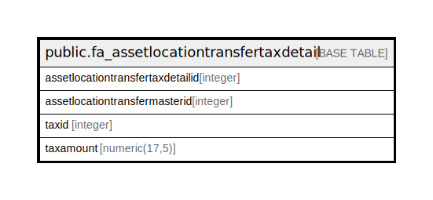

# public.fa_assetlocationtransfertaxdetail

## Description

## Columns

| Name | Type | Default | Nullable | Children | Parents | Comment |
| ---- | ---- | ------- | -------- | -------- | ------- | ------- |
| assetlocationtransfertaxdetailid | integer | nextval('fa_assetlocationtransfertaxde_assetlocationtransfertaxdetai_seq'::regclass) | false |  |  |  |
| assetlocationtransfermasterid | integer |  | true |  |  |  |
| taxid | integer |  | true |  |  |  |
| taxamount | numeric(17,5) | 0 | true |  |  |  |

## Constraints

| Name | Type | Definition |
| ---- | ---- | ---------- |
| fa_assetlocationtransfertaxdetail_pkey | PRIMARY KEY | PRIMARY KEY (assetlocationtransfertaxdetailid) |

## Indexes

| Name | Definition |
| ---- | ---------- |
| fa_assetlocationtransfertaxdetail_pkey | CREATE UNIQUE INDEX fa_assetlocationtransfertaxdetail_pkey ON public.fa_assetlocationtransfertaxdetail USING btree (assetlocationtransfertaxdetailid) |

## Relations

---

> Generated by [tbls](https://github.com/k1LoW/tbls)
