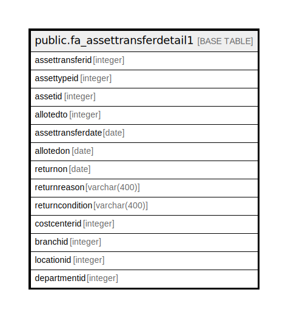

# public.fa_assettransferdetail1

## Description

## Columns

| Name | Type | Default | Nullable | Children | Parents | Comment |
| ---- | ---- | ------- | -------- | -------- | ------- | ------- |
| assettransferid | integer | nextval('fa_assettransfer_assettransferid_seq'::regclass) | false |  |  |  |
| assettypeid | integer |  | true |  |  |  |
| assetid | integer |  | true |  |  |  |
| allotedto | integer |  | true |  |  |  |
| assettransferdate | date |  | true |  |  |  |
| allotedon | date |  | true |  |  |  |
| returnon | date |  | true |  |  |  |
| returnreason | varchar(400) |  | true |  |  |  |
| returncondition | varchar(400) |  | true |  |  |  |
| costcenterid | integer |  | true |  |  |  |
| branchid | integer |  | true |  |  |  |
| locationid | integer |  | true |  |  |  |
| departmentid | integer |  | true |  |  |  |

## Constraints

| Name | Type | Definition |
| ---- | ---- | ---------- |
| fa_assettransfer_pkey | PRIMARY KEY | PRIMARY KEY (assettransferid) |

## Indexes

| Name | Definition |
| ---- | ---------- |
| fa_assettransfer_pkey | CREATE UNIQUE INDEX fa_assettransfer_pkey ON public.fa_assettransferdetail1 USING btree (assettransferid) |

## Relations

---

> Generated by [tbls](https://github.com/k1LoW/tbls)
