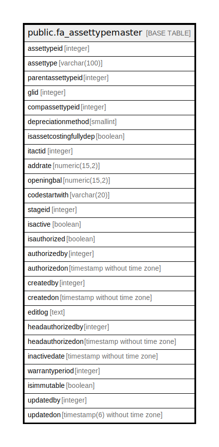

# public.fa_assettypemaster

## Description

## Columns

| Name | Type | Default | Nullable | Children | Parents | Comment |
| ---- | ---- | ------- | -------- | -------- | ------- | ------- |
| assettypeid | integer | nextval('fa_assettypemaster_assettypeid_seq'::regclass) | false |  |  |  |
| assettype | varchar(100) |  | true |  |  |  |
| parentassettypeid | integer |  | true |  |  |  |
| glid | integer |  | true |  |  |  |
| compassettypeid | integer |  | true |  |  |  |
| depreciationmethod | smallint |  | true |  |  |  |
| isassetcostingfullydep | boolean |  | true |  |  |  |
| itactid | integer |  | true |  |  |  |
| addrate | numeric(15,2) |  | true |  |  |  |
| openingbal | numeric(15,2) |  | true |  |  |  |
| codestartwith | varchar(20) |  | true |  |  |  |
| stageid | integer |  | true |  |  |  |
| isactive | boolean | false | false |  |  |  |
| isauthorized | boolean | false | false |  |  |  |
| authorizedby | integer |  | true |  |  |  |
| authorizedon | timestamp without time zone |  | true |  |  |  |
| createdby | integer |  | true |  |  |  |
| createdon | timestamp without time zone | now() | true |  |  |  |
| editlog | text |  | true |  |  |  |
| headauthorizedby | integer |  | true |  |  |  |
| headauthorizedon | timestamp without time zone |  | true |  |  |  |
| inactivedate | timestamp without time zone |  | true |  |  |  |
| warrantyperiod | integer | 0 | true |  |  |  |
| isimmutable | boolean | false | false |  |  |  |
| updatedby | integer |  | true |  |  |  |
| updatedon | timestamp(6) without time zone | NULL::timestamp without time zone | true |  |  |  |

## Constraints

| Name | Type | Definition |
| ---- | ---- | ---------- |
| assettypemaster_assettype_key | UNIQUE | UNIQUE (assettype) |
| assettypemaster_pkey | PRIMARY KEY | PRIMARY KEY (assettypeid) |

## Indexes

| Name | Definition |
| ---- | ---------- |
| assettypemaster_assettype_key | CREATE UNIQUE INDEX assettypemaster_assettype_key ON public.fa_assettypemaster USING btree (assettype) |
| assettypemaster_pkey | CREATE UNIQUE INDEX assettypemaster_pkey ON public.fa_assettypemaster USING btree (assettypeid) |

## Relations

---

> Generated by [tbls](https://github.com/k1LoW/tbls)
