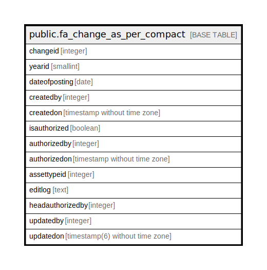

# public.fa_change_as_per_compact

## Description

## Columns

| Name | Type | Default | Nullable | Children | Parents | Comment |
| ---- | ---- | ------- | -------- | -------- | ------- | ------- |
| changeid | integer | nextval('fa_change_as_per_compact_changeid_seq'::regclass) | false |  |  |  |
| yearid | smallint |  | true |  |  |  |
| dateofposting | date |  | true |  |  |  |
| createdby | integer |  | true |  |  |  |
| createdon | timestamp without time zone | ('now'::text)::date | true |  |  |  |
| isauthorized | boolean |  | true |  |  |  |
| authorizedby | integer |  | true |  |  |  |
| authorizedon | timestamp without time zone |  | true |  |  |  |
| assettypeid | integer |  | true |  |  |  |
| editlog | text |  | true |  |  |  |
| headauthorizedby | integer |  | true |  |  |  |
| updatedby | integer |  | true |  |  |  |
| updatedon | timestamp(6) without time zone | NULL::timestamp without time zone | true |  |  |  |

## Constraints

| Name | Type | Definition |
| ---- | ---- | ---------- |
| fa_change_as_per_compact_pkey | PRIMARY KEY | PRIMARY KEY (changeid) |

## Indexes

| Name | Definition |
| ---- | ---------- |
| fa_change_as_per_compact_pkey | CREATE UNIQUE INDEX fa_change_as_per_compact_pkey ON public.fa_change_as_per_compact USING btree (changeid) |

## Relations

---

> Generated by [tbls](https://github.com/k1LoW/tbls)
