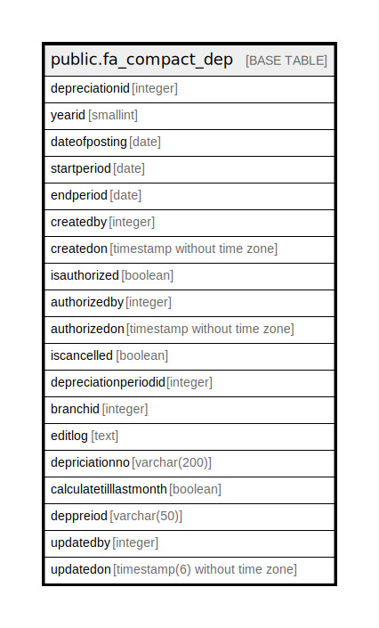

# public.fa_compact_dep

## Description

## Columns

| Name | Type | Default | Nullable | Children | Parents | Comment |
| ---- | ---- | ------- | -------- | -------- | ------- | ------- |
| depreciationid | integer | nextval('fa_compact_dep_depreciationid_seq'::regclass) | false |  |  |  |
| yearid | smallint |  | true |  |  |  |
| dateofposting | date |  | true |  |  |  |
| startperiod | date |  | true |  |  |  |
| endperiod | date | now() | true |  |  |  |
| createdby | integer |  | true |  |  |  |
| createdon | timestamp without time zone | now() | true |  |  |  |
| isauthorized | boolean |  | true |  |  |  |
| authorizedby | integer |  | true |  |  |  |
| authorizedon | timestamp without time zone |  | true |  |  |  |
| iscancelled | boolean | false | true |  |  |  |
| depreciationperiodid | integer |  | true |  |  |  |
| branchid | integer |  | true |  |  |  |
| editlog | text |  | true |  |  |  |
| depriciationno | varchar(200) | ''::character varying | false |  |  |  |
| calculatetilllastmonth | boolean | false | false |  |  |  |
| deppreiod | varchar(50) | ''::character varying | false |  |  |  |
| updatedby | integer |  | true |  |  |  |
| updatedon | timestamp(6) without time zone | NULL::timestamp without time zone | true |  |  |  |

## Constraints

| Name | Type | Definition |
| ---- | ---- | ---------- |
| fa_compact_dep_pkey | PRIMARY KEY | PRIMARY KEY (depreciationid) |

## Indexes

| Name | Definition |
| ---- | ---------- |
| fa_compact_dep_pkey | CREATE UNIQUE INDEX fa_compact_dep_pkey ON public.fa_compact_dep USING btree (depreciationid) |

## Relations

---

> Generated by [tbls](https://github.com/k1LoW/tbls)
