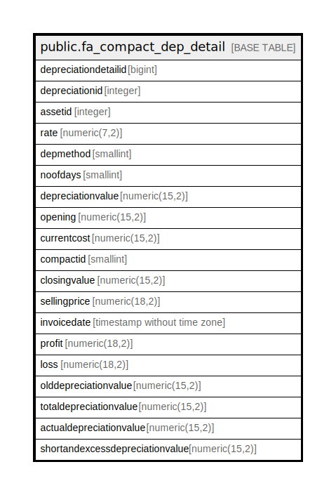

# public.fa_compact_dep_detail

## Description

## Columns

| Name | Type | Default | Nullable | Children | Parents | Comment |
| ---- | ---- | ------- | -------- | -------- | ------- | ------- |
| depreciationdetailid | bigint | nextval('fa_compact_dep_detail_depreciationdetailid_seq'::regclass) | false |  |  |  |
| depreciationid | integer |  | true |  |  |  |
| assetid | integer |  | true |  |  |  |
| rate | numeric(7,2) |  | true |  |  |  |
| depmethod | smallint |  | true |  |  |  |
| noofdays | smallint |  | true |  |  |  |
| depreciationvalue | numeric(15,2) |  | true |  |  |  |
| opening | numeric(15,2) |  | true |  |  |  |
| currentcost | numeric(15,2) |  | true |  |  |  |
| compactid | smallint |  | true |  |  |  |
| closingvalue | numeric(15,2) |  | true |  |  |  |
| sellingprice | numeric(18,2) |  | true |  |  |  |
| invoicedate | timestamp without time zone |  | true |  |  |  |
| profit | numeric(18,2) |  | true |  |  |  |
| loss | numeric(18,2) |  | true |  |  |  |
| olddepreciationvalue | numeric(15,2) |  | true |  |  |  |
| totaldepreciationvalue | numeric(15,2) |  | true |  |  |  |
| actualdepreciationvalue | numeric(15,2) | 0 | false |  |  |  |
| shortandexcessdepreciationvalue | numeric(15,2) | 0 | false |  |  |  |

## Constraints

| Name | Type | Definition |
| ---- | ---- | ---------- |
| fa_compact_dep_detail_pkey | PRIMARY KEY | PRIMARY KEY (depreciationdetailid) |

## Indexes

| Name | Definition |
| ---- | ---------- |
| fa_compact_dep_detail_pkey | CREATE UNIQUE INDEX fa_compact_dep_detail_pkey ON public.fa_compact_dep_detail USING btree (depreciationdetailid) |

## Relations

---

> Generated by [tbls](https://github.com/k1LoW/tbls)
