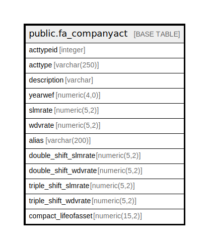

# public.fa_companyact

## Description

## Columns

| Name | Type | Default | Nullable | Children | Parents | Comment |
| ---- | ---- | ------- | -------- | -------- | ------- | ------- |
| acttypeid | integer | nextval('fa_companyact_compdepid_seq'::regclass) | false |  |  |  |
| acttype | varchar(250) |  | true |  |  |  |
| description | varchar |  | true |  |  |  |
| yearwef | numeric(4,0) |  | true |  |  |  |
| slmrate | numeric(5,2) |  | true |  |  |  |
| wdvrate | numeric(5,2) |  | true |  |  |  |
| alias | varchar(200) |  | true |  |  |  |
| double_shift_slmrate | numeric(5,2) |  | true |  |  |  |
| double_shift_wdvrate | numeric(5,2) |  | true |  |  |  |
| triple_shift_slmrate | numeric(5,2) |  | true |  |  |  |
| triple_shift_wdvrate | numeric(5,2) |  | true |  |  |  |
| compact_lifeofasset | numeric(15,2) | 1 | true |  |  |  |

## Constraints

| Name | Type | Definition |
| ---- | ---- | ---------- |
| fa_companyact_pk_depratecompact_pkey | PRIMARY KEY | PRIMARY KEY (acttypeid) |

## Indexes

| Name | Definition |
| ---- | ---------- |
| fa_companyact_pk_depratecompact_pkey | CREATE UNIQUE INDEX fa_companyact_pk_depratecompact_pkey ON public.fa_companyact USING btree (acttypeid) |

## Relations

---

> Generated by [tbls](https://github.com/k1LoW/tbls)
