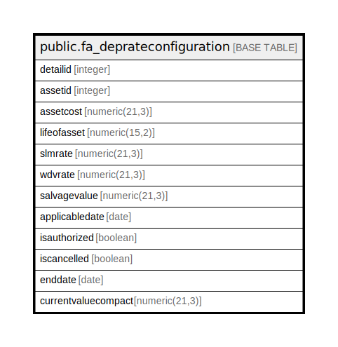

# public.fa_deprateconfiguration

## Description

## Columns

| Name | Type | Default | Nullable | Children | Parents | Comment |
| ---- | ---- | ------- | -------- | -------- | ------- | ------- |
| detailid | integer | nextval('fa_deprateconfiguration_detailid_seq'::regclass) | false |  |  |  |
| assetid | integer |  | true |  |  |  |
| assetcost | numeric(21,3) |  | true |  |  |  |
| lifeofasset | numeric(15,2) |  | true |  |  |  |
| slmrate | numeric(21,3) |  | true |  |  |  |
| wdvrate | numeric(21,3) |  | true |  |  |  |
| salvagevalue | numeric(21,3) |  | true |  |  |  |
| applicabledate | date |  | true |  |  |  |
| isauthorized | boolean |  | true |  |  |  |
| iscancelled | boolean |  | true |  |  |  |
| enddate | date |  | true |  |  |  |
| currentvaluecompact | numeric(21,3) |  | true |  |  |  |

## Constraints

| Name | Type | Definition |
| ---- | ---- | ---------- |
| fa_deprateconfiguration_pkey | PRIMARY KEY | PRIMARY KEY (detailid) |

## Indexes

| Name | Definition |
| ---- | ---------- |
| fa_deprateconfiguration_pkey | CREATE UNIQUE INDEX fa_deprateconfiguration_pkey ON public.fa_deprateconfiguration USING btree (detailid) |

## Relations

---

> Generated by [tbls](https://github.com/k1LoW/tbls)
