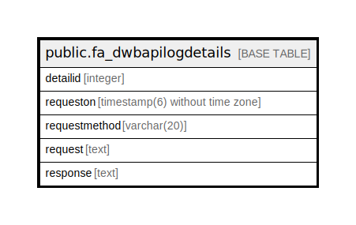

# public.fa_dwbapilogdetails

## Description

## Columns

| Name | Type | Default | Nullable | Children | Parents | Comment |
| ---- | ---- | ------- | -------- | -------- | ------- | ------- |
| detailid | integer | nextval('fa_dwbapilogdetails_detailid_seq'::regclass) | false |  |  |  |
| requeston | timestamp(6) without time zone |  | true |  |  |  |
| requestmethod | varchar(20) |  | true |  |  |  |
| request | text |  | true |  |  |  |
| response | text |  | true |  |  |  |

## Relations

---

> Generated by [tbls](https://github.com/k1LoW/tbls)
