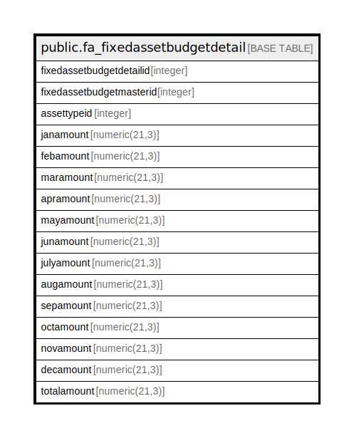

# public.fa_fixedassetbudgetdetail

## Description

## Columns

| Name | Type | Default | Nullable | Children | Parents | Comment |
| ---- | ---- | ------- | -------- | -------- | ------- | ------- |
| fixedassetbudgetdetailid | integer | nextval('fa_fixedassetbudgetdetail_fixedassetbudgetdetailid_seq'::regclass) | false |  |  |  |
| fixedassetbudgetmasterid | integer |  | true |  |  |  |
| assettypeid | integer |  | true |  |  |  |
| janamount | numeric(21,3) |  | true |  |  |  |
| febamount | numeric(21,3) |  | true |  |  |  |
| maramount | numeric(21,3) |  | true |  |  |  |
| apramount | numeric(21,3) |  | true |  |  |  |
| mayamount | numeric(21,3) |  | true |  |  |  |
| junamount | numeric(21,3) |  | true |  |  |  |
| julyamount | numeric(21,3) |  | true |  |  |  |
| augamount | numeric(21,3) |  | true |  |  |  |
| sepamount | numeric(21,3) |  | true |  |  |  |
| octamount | numeric(21,3) |  | true |  |  |  |
| novamount | numeric(21,3) |  | true |  |  |  |
| decamount | numeric(21,3) |  | true |  |  |  |
| totalamount | numeric(21,3) |  | true |  |  |  |

## Constraints

| Name | Type | Definition |
| ---- | ---- | ---------- |
| fa_fixedassetbudgetdetail_pkey | PRIMARY KEY | PRIMARY KEY (fixedassetbudgetdetailid) |

## Indexes

| Name | Definition |
| ---- | ---------- |
| fa_fixedassetbudgetdetail_pkey | CREATE UNIQUE INDEX fa_fixedassetbudgetdetail_pkey ON public.fa_fixedassetbudgetdetail USING btree (fixedassetbudgetdetailid) |

## Relations

---

> Generated by [tbls](https://github.com/k1LoW/tbls)
