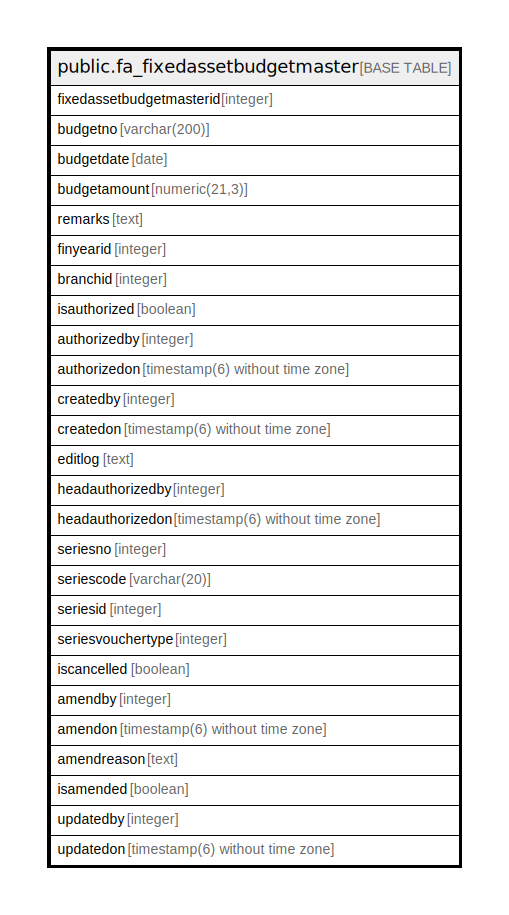

# public.fa_fixedassetbudgetmaster

## Description

## Columns

| Name | Type | Default | Nullable | Children | Parents | Comment |
| ---- | ---- | ------- | -------- | -------- | ------- | ------- |
| fixedassetbudgetmasterid | integer | nextval('fa_fixedassetbudgetmaster_fixedassetbudgetmasterid_seq'::regclass) | false |  |  |  |
| budgetno | varchar(200) |  | true |  |  |  |
| budgetdate | date |  | true |  |  |  |
| budgetamount | numeric(21,3) |  | true |  |  |  |
| remarks | text |  | true |  |  |  |
| finyearid | integer |  | true |  |  |  |
| branchid | integer |  | true |  |  |  |
| isauthorized | boolean | false | true |  |  |  |
| authorizedby | integer |  | true |  |  |  |
| authorizedon | timestamp(6) without time zone |  | true |  |  |  |
| createdby | integer |  | true |  |  |  |
| createdon | timestamp(6) without time zone | now() | true |  |  |  |
| editlog | text |  | true |  |  |  |
| headauthorizedby | integer |  | true |  |  |  |
| headauthorizedon | timestamp(6) without time zone |  | true |  |  |  |
| seriesno | integer |  | true |  |  |  |
| seriescode | varchar(20) |  | true |  |  |  |
| seriesid | integer |  | true |  |  |  |
| seriesvouchertype | integer |  | true |  |  |  |
| iscancelled | boolean |  | true |  |  |  |
| amendby | integer |  | true |  |  |  |
| amendon | timestamp(6) without time zone |  | true |  |  |  |
| amendreason | text |  | true |  |  |  |
| isamended | boolean | false | true |  |  |  |
| updatedby | integer |  | true |  |  |  |
| updatedon | timestamp(6) without time zone | NULL::timestamp without time zone | true |  |  |  |

## Constraints

| Name | Type | Definition |
| ---- | ---- | ---------- |
| fa_fixedassetbudgetmaster_pkey | PRIMARY KEY | PRIMARY KEY (fixedassetbudgetmasterid) |

## Indexes

| Name | Definition |
| ---- | ---------- |
| fa_fixedassetbudgetmaster_pkey | CREATE UNIQUE INDEX fa_fixedassetbudgetmaster_pkey ON public.fa_fixedassetbudgetmaster USING btree (fixedassetbudgetmasterid) |

## Relations

---

> Generated by [tbls](https://github.com/k1LoW/tbls)
