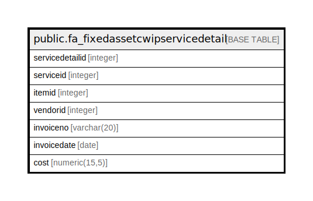

# public.fa_fixedassetcwipservicedetail

## Description

## Columns

| Name | Type | Default | Nullable | Children | Parents | Comment |
| ---- | ---- | ------- | -------- | -------- | ------- | ------- |
| servicedetailid | integer | nextval('fa_fixedassetcwipservicedetail_servicedetailid_seq'::regclass) | false |  |  |  |
| serviceid | integer |  | true |  |  |  |
| itemid | integer |  | true |  |  |  |
| vendorid | integer |  | true |  |  |  |
| invoiceno | varchar(20) |  | true |  |  |  |
| invoicedate | date |  | true |  |  |  |
| cost | numeric(15,5) |  | true |  |  |  |

## Constraints

| Name | Type | Definition |
| ---- | ---- | ---------- |
| fa_fixedassetcwipservicedetail_pkey | PRIMARY KEY | PRIMARY KEY (servicedetailid) |

## Indexes

| Name | Definition |
| ---- | ---------- |
| fa_fixedassetcwipservicedetail_pkey | CREATE UNIQUE INDEX fa_fixedassetcwipservicedetail_pkey ON public.fa_fixedassetcwipservicedetail USING btree (servicedetailid) |

## Relations

---

> Generated by [tbls](https://github.com/k1LoW/tbls)
