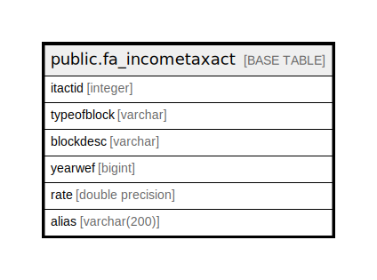

# public.fa_incometaxact

## Description

## Columns

| Name | Type | Default | Nullable | Children | Parents | Comment |
| ---- | ---- | ------- | -------- | -------- | ------- | ------- |
| itactid | integer | nextval('fa_incometaxact_itactid_seq'::regclass) | false |  |  |  |
| typeofblock | varchar |  | true |  |  |  |
| blockdesc | varchar |  | true |  |  |  |
| yearwef | bigint |  | true |  |  |  |
| rate | double precision |  | true |  |  |  |
| alias | varchar(200) |  | true |  |  |  |

## Constraints

| Name | Type | Definition |
| ---- | ---- | ---------- |
| fa_incometaxact_pkey | PRIMARY KEY | PRIMARY KEY (itactid) |

## Indexes

| Name | Definition |
| ---- | ---------- |
| fa_incometaxact_pkey | CREATE UNIQUE INDEX fa_incometaxact_pkey ON public.fa_incometaxact USING btree (itactid) |

## Relations

---

> Generated by [tbls](https://github.com/k1LoW/tbls)
