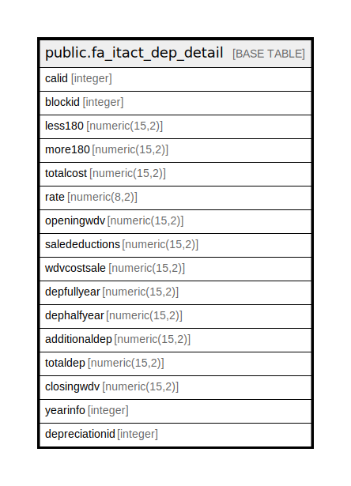

# public.fa_itact_dep_detail

## Description

## Columns

| Name | Type | Default | Nullable | Children | Parents | Comment |
| ---- | ---- | ------- | -------- | -------- | ------- | ------- |
| calid | integer | nextval('fa_itact_dep_detail_calid_seq'::regclass) | false |  |  |  |
| blockid | integer |  | true |  |  |  |
| less180 | numeric(15,2) |  | true |  |  |  |
| more180 | numeric(15,2) |  | true |  |  |  |
| totalcost | numeric(15,2) |  | true |  |  |  |
| rate | numeric(8,2) |  | true |  |  |  |
| openingwdv | numeric(15,2) |  | true |  |  |  |
| saledeductions | numeric(15,2) |  | true |  |  |  |
| wdvcostsale | numeric(15,2) |  | true |  |  |  |
| depfullyear | numeric(15,2) |  | true |  |  |  |
| dephalfyear | numeric(15,2) |  | true |  |  |  |
| additionaldep | numeric(15,2) |  | true |  |  |  |
| totaldep | numeric(15,2) |  | true |  |  |  |
| closingwdv | numeric(15,2) |  | true |  |  |  |
| yearinfo | integer |  | true |  |  |  |
| depreciationid | integer |  | true |  |  |  |

## Constraints

| Name | Type | Definition |
| ---- | ---- | ---------- |
| fa_itact_dep_detail_pkey | PRIMARY KEY | PRIMARY KEY (calid) |

## Indexes

| Name | Definition |
| ---- | ---------- |
| fa_itact_dep_detail_pkey | CREATE UNIQUE INDEX fa_itact_dep_detail_pkey ON public.fa_itact_dep_detail USING btree (calid) |

## Relations

---

> Generated by [tbls](https://github.com/k1LoW/tbls)
