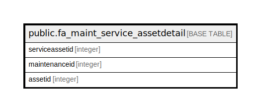

# public.fa_maint_service_assetdetail

## Description

## Columns

| Name | Type | Default | Nullable | Children | Parents | Comment |
| ---- | ---- | ------- | -------- | -------- | ------- | ------- |
| serviceassetid | integer | nextval('fa_maint_service_assetdetail_serviceassetid_seq'::regclass) | false |  |  |  |
| maintenanceid | integer |  | true |  |  |  |
| assetid | integer |  | true |  |  |  |

## Constraints

| Name | Type | Definition |
| ---- | ---- | ---------- |
| fa_Maint_Service_assetDetail_pkey | PRIMARY KEY | PRIMARY KEY (serviceassetid) |

## Indexes

| Name | Definition |
| ---- | ---------- |
| fa_Maint_Service_assetDetail_pkey | CREATE UNIQUE INDEX "fa_Maint_Service_assetDetail_pkey" ON public.fa_maint_service_assetdetail USING btree (serviceassetid) |

## Relations

---

> Generated by [tbls](https://github.com/k1LoW/tbls)
