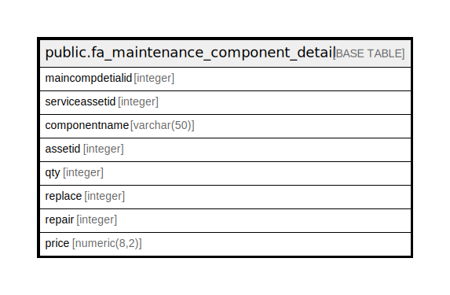

# public.fa_maintenance_component_detail

## Description

## Columns

| Name | Type | Default | Nullable | Children | Parents | Comment |
| ---- | ---- | ------- | -------- | -------- | ------- | ------- |
| maincompdetialid | integer | nextval(('"public"."fa_maintenance_component_detail_maincompdetialid_seq"'::text)::regclass) | false |  |  |  |
| serviceassetid | integer |  | true |  |  |  |
| componentname | varchar(50) |  | true |  |  |  |
| assetid | integer |  | true |  |  |  |
| qty | integer |  | true |  |  |  |
| replace | integer |  | true |  |  |  |
| repair | integer |  | true |  |  |  |
| price | numeric(8,2) |  | true |  |  |  |

## Constraints

| Name | Type | Definition |
| ---- | ---- | ---------- |
| fa_maintenance_component_detail_pkey | PRIMARY KEY | PRIMARY KEY (maincompdetialid) |

## Indexes

| Name | Definition |
| ---- | ---------- |
| fa_maintenance_component_detail_pkey | CREATE UNIQUE INDEX fa_maintenance_component_detail_pkey ON public.fa_maintenance_component_detail USING btree (maincompdetialid) |

## Relations

---

> Generated by [tbls](https://github.com/k1LoW/tbls)
