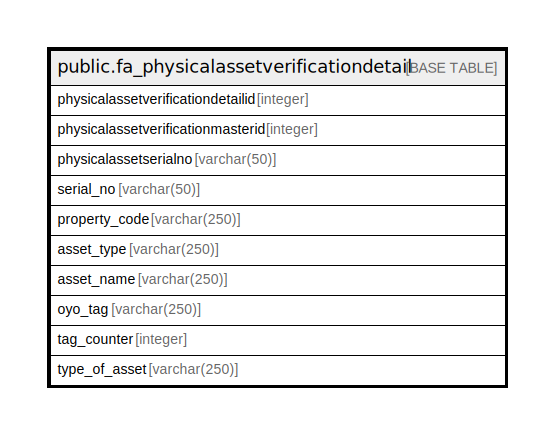

# public.fa_physicalassetverificationdetail

## Description

## Columns

| Name | Type | Default | Nullable | Children | Parents | Comment |
| ---- | ---- | ------- | -------- | -------- | ------- | ------- |
| physicalassetverificationdetailid | integer | nextval('fa_physicalassetverificationd_physicalassetverificationdeta_seq'::regclass) | false |  |  |  |
| physicalassetverificationmasterid | integer |  | true |  |  |  |
| physicalassetserialno | varchar(50) |  | true |  |  |  |
| serial_no | varchar(50) |  | true |  |  |  |
| property_code | varchar(250) |  | true |  |  |  |
| asset_type | varchar(250) |  | true |  |  |  |
| asset_name | varchar(250) |  | true |  |  |  |
| oyo_tag | varchar(250) |  | true |  |  |  |
| tag_counter | integer |  | true |  |  |  |
| type_of_asset | varchar(250) |  | true |  |  |  |

## Constraints

| Name | Type | Definition |
| ---- | ---- | ---------- |
| pk_fa_physicalassetverificationdetail_detailid | PRIMARY KEY | PRIMARY KEY (physicalassetverificationdetailid) |

## Indexes

| Name | Definition |
| ---- | ---------- |
| pk_fa_physicalassetverificationdetail_detailid | CREATE UNIQUE INDEX pk_fa_physicalassetverificationdetail_detailid ON public.fa_physicalassetverificationdetail USING btree (physicalassetverificationdetailid) |

## Relations

---

> Generated by [tbls](https://github.com/k1LoW/tbls)
