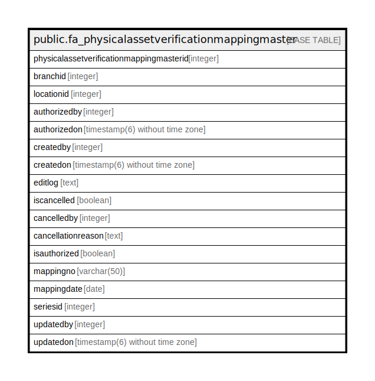

# public.fa_physicalassetverificationmappingmaster

## Description

## Columns

| Name | Type | Default | Nullable | Children | Parents | Comment |
| ---- | ---- | ------- | -------- | -------- | ------- | ------- |
| physicalassetverificationmappingmasterid | integer | nextval('fa_physicalassetverificationm_physicalassetverificationmapp_seq'::regclass) | false |  |  |  |
| branchid | integer |  | true |  |  |  |
| locationid | integer |  | true |  |  |  |
| authorizedby | integer |  | true |  |  |  |
| authorizedon | timestamp(6) without time zone |  | true |  |  |  |
| createdby | integer |  | true |  |  |  |
| createdon | timestamp(6) without time zone |  | true |  |  |  |
| editlog | text |  | true |  |  |  |
| iscancelled | boolean | false | true |  |  |  |
| cancelledby | integer |  | true |  |  |  |
| cancellationreason | text |  | true |  |  |  |
| isauthorized | boolean | false | true |  |  |  |
| mappingno | varchar(50) |  | true |  |  |  |
| mappingdate | date |  | true |  |  |  |
| seriesid | integer |  | true |  |  |  |
| updatedby | integer |  | true |  |  |  |
| updatedon | timestamp(6) without time zone | NULL::timestamp without time zone | true |  |  |  |

## Constraints

| Name | Type | Definition |
| ---- | ---- | ---------- |
| pk_fa_physicalassetverificationmappingmaster_masterid | PRIMARY KEY | PRIMARY KEY (physicalassetverificationmappingmasterid) |
| uniquemappingno | UNIQUE | UNIQUE (mappingdate, mappingno) |

## Indexes

| Name | Definition |
| ---- | ---------- |
| pk_fa_physicalassetverificationmappingmaster_masterid | CREATE UNIQUE INDEX pk_fa_physicalassetverificationmappingmaster_masterid ON public.fa_physicalassetverificationmappingmaster USING btree (physicalassetverificationmappingmasterid) |
| uniquemappingno | CREATE UNIQUE INDEX uniquemappingno ON public.fa_physicalassetverificationmappingmaster USING btree (mappingdate, mappingno) |

## Relations

---

> Generated by [tbls](https://github.com/k1LoW/tbls)
