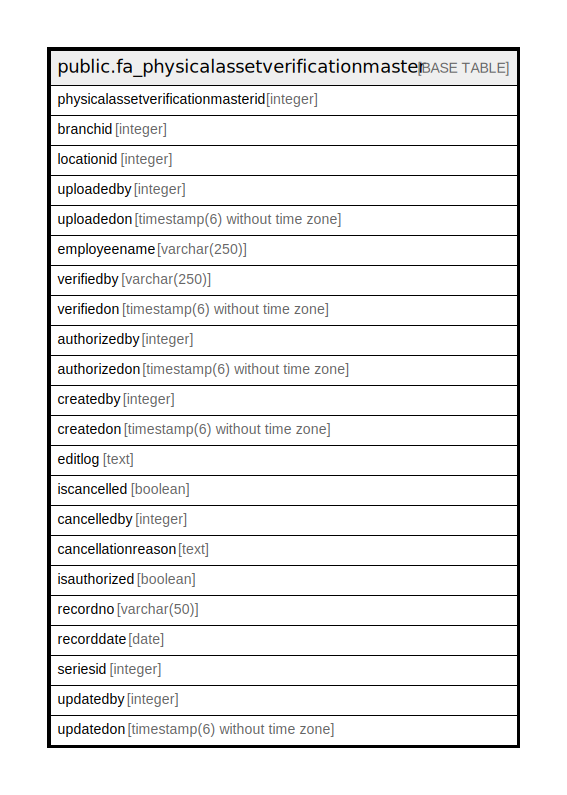

# public.fa_physicalassetverificationmaster

## Description

## Columns

| Name | Type | Default | Nullable | Children | Parents | Comment |
| ---- | ---- | ------- | -------- | -------- | ------- | ------- |
| physicalassetverificationmasterid | integer | nextval('fa_physicalassetverificationm_physicalassetverificationmast_seq'::regclass) | false |  |  |  |
| branchid | integer |  | true |  |  |  |
| locationid | integer |  | true |  |  |  |
| uploadedby | integer |  | true |  |  |  |
| uploadedon | timestamp(6) without time zone |  | true |  |  |  |
| employeename | varchar(250) |  | true |  |  |  |
| verifiedby | varchar(250) |  | true |  |  |  |
| verifiedon | timestamp(6) without time zone |  | true |  |  |  |
| authorizedby | integer |  | true |  |  |  |
| authorizedon | timestamp(6) without time zone |  | true |  |  |  |
| createdby | integer |  | true |  |  |  |
| createdon | timestamp(6) without time zone |  | true |  |  |  |
| editlog | text |  | true |  |  |  |
| iscancelled | boolean | false | true |  |  |  |
| cancelledby | integer |  | true |  |  |  |
| cancellationreason | text |  | true |  |  |  |
| isauthorized | boolean | false | true |  |  |  |
| recordno | varchar(50) |  | true |  |  |  |
| recorddate | date |  | true |  |  |  |
| seriesid | integer |  | true |  |  |  |
| updatedby | integer |  | true |  |  |  |
| updatedon | timestamp(6) without time zone | NULL::timestamp without time zone | true |  |  |  |

## Constraints

| Name | Type | Definition |
| ---- | ---- | ---------- |
| pk_fa_physicalassetverificationmaster_masterid | PRIMARY KEY | PRIMARY KEY (physicalassetverificationmasterid) |
| uniquerecordno | UNIQUE | UNIQUE (recorddate, recordno) |

## Indexes

| Name | Definition |
| ---- | ---------- |
| pk_fa_physicalassetverificationmaster_masterid | CREATE UNIQUE INDEX pk_fa_physicalassetverificationmaster_masterid ON public.fa_physicalassetverificationmaster USING btree (physicalassetverificationmasterid) |
| uniquerecordno | CREATE UNIQUE INDEX uniquerecordno ON public.fa_physicalassetverificationmaster USING btree (recorddate, recordno) |

## Relations

---

> Generated by [tbls](https://github.com/k1LoW/tbls)
