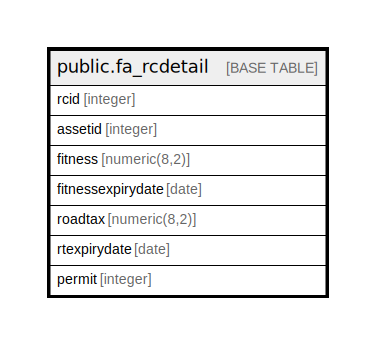

# public.fa_rcdetail

## Description

## Columns

| Name | Type | Default | Nullable | Children | Parents | Comment |
| ---- | ---- | ------- | -------- | -------- | ------- | ------- |
| rcid | integer | nextval('fa_rcdetail_rcid_seq'::regclass) | false |  |  |  |
| assetid | integer |  | true |  |  |  |
| fitness | numeric(8,2) |  | true |  |  |  |
| fitnessexpirydate | date |  | true |  |  |  |
| roadtax | numeric(8,2) |  | true |  |  |  |
| rtexpirydate | date |  | true |  |  |  |
| permit | integer |  | true |  |  |  |

## Constraints

| Name | Type | Definition |
| ---- | ---- | ---------- |
| fa_rcdetail_pkey | PRIMARY KEY | PRIMARY KEY (rcid) |

## Indexes

| Name | Definition |
| ---- | ---------- |
| fa_rcdetail_pkey | CREATE UNIQUE INDEX fa_rcdetail_pkey ON public.fa_rcdetail USING btree (rcid) |

## Relations

---

> Generated by [tbls](https://github.com/k1LoW/tbls)
