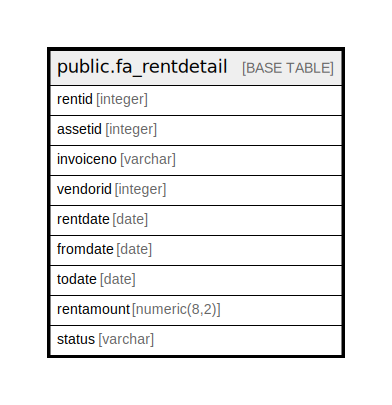

# public.fa_rentdetail

## Description

## Columns

| Name | Type | Default | Nullable | Children | Parents | Comment |
| ---- | ---- | ------- | -------- | -------- | ------- | ------- |
| rentid | integer | nextval('fa_rentdetail_rentid_seq'::regclass) | false |  |  |  |
| assetid | integer |  | true |  |  |  |
| invoiceno | varchar |  | true |  |  |  |
| vendorid | integer |  | true |  |  |  |
| rentdate | date |  | true |  |  |  |
| fromdate | date |  | true |  |  |  |
| todate | date |  | true |  |  |  |
| rentamount | numeric(8,2) |  | true |  |  |  |
| status | varchar |  | true |  |  |  |

## Constraints

| Name | Type | Definition |
| ---- | ---- | ---------- |
| fa_rentdetail_pkey | PRIMARY KEY | PRIMARY KEY (rentid) |

## Indexes

| Name | Definition |
| ---- | ---------- |
| fa_rentdetail_pkey | CREATE UNIQUE INDEX fa_rentdetail_pkey ON public.fa_rentdetail USING btree (rentid) |

## Relations

---

> Generated by [tbls](https://github.com/k1LoW/tbls)
