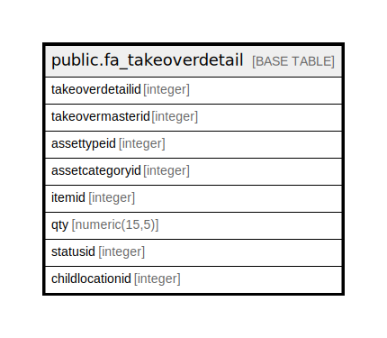

# public.fa_takeoverdetail

## Description

## Columns

| Name | Type | Default | Nullable | Children | Parents | Comment |
| ---- | ---- | ------- | -------- | -------- | ------- | ------- |
| takeoverdetailid | integer | nextval('fa_takeoverdetail_takeoverdetailid_seq'::regclass) | false |  |  |  |
| takeovermasterid | integer |  | true |  |  |  |
| assettypeid | integer |  | true |  |  |  |
| assetcategoryid | integer |  | true |  |  |  |
| itemid | integer |  | true |  |  |  |
| qty | numeric(15,5) | 0 | false |  |  |  |
| statusid | integer |  | true |  |  |  |
| childlocationid | integer |  | true |  |  |  |

## Constraints

| Name | Type | Definition |
| ---- | ---- | ---------- |
| fa_takeoverdetail_pkey | PRIMARY KEY | PRIMARY KEY (takeoverdetailid) |

## Indexes

| Name | Definition |
| ---- | ---------- |
| fa_takeoverdetail_pkey | CREATE UNIQUE INDEX fa_takeoverdetail_pkey ON public.fa_takeoverdetail USING btree (takeoverdetailid) |

## Relations

---

> Generated by [tbls](https://github.com/k1LoW/tbls)
