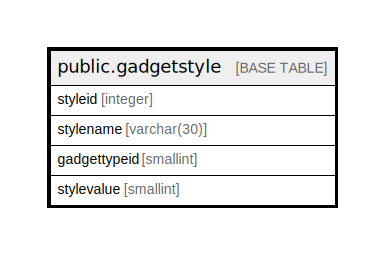

# public.gadgetstyle

## Description

## Columns

| Name | Type | Default | Nullable | Children | Parents | Comment |
| ---- | ---- | ------- | -------- | -------- | ------- | ------- |
| styleid | integer | nextval('gadgetstyle_styleid_seq'::regclass) | false |  |  |  |
| stylename | varchar(30) | NULL::character varying | true |  |  |  |
| gadgettypeid | smallint |  | true |  |  |  |
| stylevalue | smallint |  | true |  |  |  |

## Constraints

| Name | Type | Definition |
| ---- | ---- | ---------- |
| gadgetstyleid_pkey | PRIMARY KEY | PRIMARY KEY (styleid) |

## Indexes

| Name | Definition |
| ---- | ---------- |
| gadgetstyleid_pkey | CREATE UNIQUE INDEX gadgetstyleid_pkey ON public.gadgetstyle USING btree (styleid) |

## Relations

---

> Generated by [tbls](https://github.com/k1LoW/tbls)
