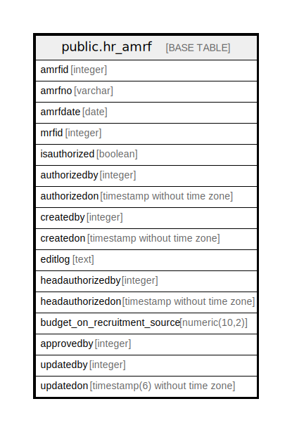

# public.hr_amrf

## Description

## Columns

| Name | Type | Default | Nullable | Children | Parents | Comment |
| ---- | ---- | ------- | -------- | -------- | ------- | ------- |
| amrfid | integer | nextval('hr_amrf_amrfid_seq'::regclass) | false |  |  |  |
| amrfno | varchar |  | false |  |  |  |
| amrfdate | date |  | false |  |  |  |
| approvedby | boolean | false | true |  |  |  |
| mrfid | integer |  | false |  |  |  |
| isauthorized | boolean | false | false |  |  |  |
| authorizedby | integer |  | true |  |  |  |
| authorizedon | timestamp without time zone |  | true |  |  |  |
| createdby | integer |  | true |  |  |  |
| createdon | timestamp without time zone | now() | true |  |  |  |
| editlog | text |  | true |  |  |  |
| headauthorizedby | integer |  | true |  |  |  |
| headauthorizedon | timestamp without time zone |  | true |  |  |  |
| budget_on_recruitment_source | numeric(10,2) |  | true |  |  |  |
| updatedby | integer |  | true |  |  |  |
| updatedon | timestamp(6) without time zone | NULL::timestamp without time zone | true |  |  |  |

## Constraints

| Name | Type | Definition |
| ---- | ---- | ---------- |
| hr_amrf_pkey | PRIMARY KEY | PRIMARY KEY (amrfid) |

## Indexes

| Name | Definition |
| ---- | ---------- |
| hr_amrf_pkey | CREATE UNIQUE INDEX hr_amrf_pkey ON public.hr_amrf USING btree (amrfid) |
| uq_amrfno | CREATE UNIQUE INDEX uq_amrfno ON public.hr_amrf USING btree (lower((amrfno)::text)) |

## Relations

---

> Generated by [tbls](https://github.com/k1LoW/tbls)
