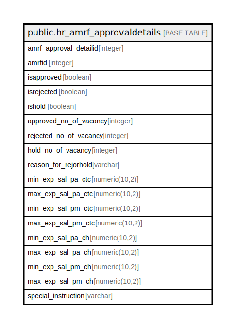

# public.hr_amrf_approvaldetails

## Description

## Columns

| Name | Type | Default | Nullable | Children | Parents | Comment |
| ---- | ---- | ------- | -------- | -------- | ------- | ------- |
| amrf_approval_detailid | integer | nextval('hr_amrf_approvaldetails_amrf_approval_detailid_seq'::regclass) | false |  |  |  |
| amrfid | integer |  | false |  |  |  |
| isapproved | boolean |  | true |  |  |  |
| isrejected | boolean |  | true |  |  |  |
| ishold | boolean |  | true |  |  |  |
| approved_no_of_vacancy | integer |  | true |  |  |  |
| rejected_no_of_vacancy | integer |  | true |  |  |  |
| hold_no_of_vacancy | integer |  | true |  |  |  |
| reason_for_rejorhold | varchar |  | true |  |  |  |
| min_exp_sal_pa_ctc | numeric(10,2) |  | true |  |  |  |
| max_exp_sal_pa_ctc | numeric(10,2) |  | true |  |  |  |
| min_exp_sal_pm_ctc | numeric(10,2) |  | true |  |  |  |
| max_exp_sal_pm_ctc | numeric(10,2) |  | true |  |  |  |
| min_exp_sal_pa_ch | numeric(10,2) |  | true |  |  |  |
| max_exp_sal_pa_ch | numeric(10,2) |  | true |  |  |  |
| min_exp_sal_pm_ch | numeric(10,2) |  | true |  |  |  |
| max_exp_sal_pm_ch | numeric(10,2) |  | true |  |  |  |
| special_instruction | varchar |  | true |  |  |  |

## Constraints

| Name | Type | Definition |
| ---- | ---- | ---------- |
| hr_amrf_approvaldetails_pkey | PRIMARY KEY | PRIMARY KEY (amrf_approval_detailid) |

## Indexes

| Name | Definition |
| ---- | ---------- |
| hr_amrf_approvaldetails_pkey | CREATE UNIQUE INDEX hr_amrf_approvaldetails_pkey ON public.hr_amrf_approvaldetails USING btree (amrf_approval_detailid) |

## Relations

---

> Generated by [tbls](https://github.com/k1LoW/tbls)
