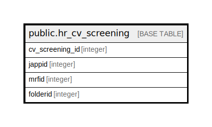

# public.hr_cv_screening

## Description

## Columns

| Name | Type | Default | Nullable | Children | Parents | Comment |
| ---- | ---- | ------- | -------- | -------- | ------- | ------- |
| cv_screening_id | integer | nextval('hr_cv_screening_cv_screening_id_seq'::regclass) | false |  |  |  |
| jappid | integer |  | false |  |  |  |
| mrfid | integer |  | true |  |  |  |
| folderid | integer |  | true |  |  |  |

## Constraints

| Name | Type | Definition |
| ---- | ---- | ---------- |
| hr_cv_screening_pkey | PRIMARY KEY | PRIMARY KEY (cv_screening_id) |

## Indexes

| Name | Definition |
| ---- | ---------- |
| hr_cv_screening_pkey | CREATE UNIQUE INDEX hr_cv_screening_pkey ON public.hr_cv_screening USING btree (cv_screening_id) |

## Relations

---

> Generated by [tbls](https://github.com/k1LoW/tbls)
