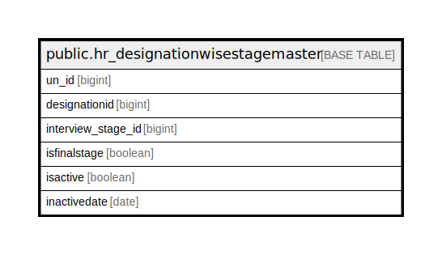

# public.hr_designationwisestagemaster

## Description

## Columns

| Name | Type | Default | Nullable | Children | Parents | Comment |
| ---- | ---- | ------- | -------- | -------- | ------- | ------- |
| un_id | bigint | nextval('hr_designationwisestagemaster_un_id_seq'::regclass) | false |  |  |  |
| designationid | bigint |  | false |  |  |  |
| interview_stage_id | bigint |  | false |  |  |  |
| isfinalstage | boolean |  | true |  |  |  |
| isactive | boolean |  | true |  |  |  |
| inactivedate | date |  | true |  |  |  |

## Constraints

| Name | Type | Definition |
| ---- | ---- | ---------- |
| hr_designationwisestagemaster_pkey | PRIMARY KEY | PRIMARY KEY (un_id) |

## Indexes

| Name | Definition |
| ---- | ---------- |
| hr_designationwisestagemaster_pkey | CREATE UNIQUE INDEX hr_designationwisestagemaster_pkey ON public.hr_designationwisestagemaster USING btree (un_id) |

## Relations

---

> Generated by [tbls](https://github.com/k1LoW/tbls)
