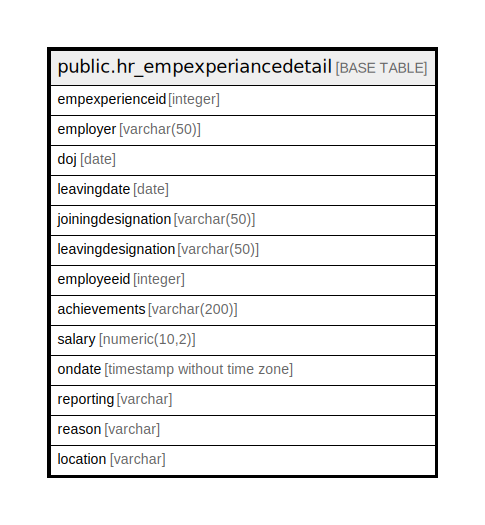

# public.hr_empexperiancedetail

## Description

## Columns

| Name | Type | Default | Nullable | Children | Parents | Comment |
| ---- | ---- | ------- | -------- | -------- | ------- | ------- |
| empexperienceid | integer | nextval('hr_empexperiancedetail_empexperienceid_seq'::regclass) | false |  |  |  |
| employer | varchar(50) |  | true |  |  |  |
| doj | date |  | true |  |  |  |
| leavingdate | date |  | true |  |  |  |
| joiningdesignation | varchar(50) |  | true |  |  |  |
| leavingdesignation | varchar(50) |  | true |  |  |  |
| employeeid | integer |  | true |  |  |  |
| achievements | varchar(200) |  | true |  |  |  |
| salary | numeric(10,2) |  | true |  |  |  |
| ondate | timestamp without time zone | now() | true |  |  |  |
| reporting | varchar |  | true |  |  |  |
| reason | varchar |  | true |  |  |  |
| location | varchar |  | true |  |  |  |

## Constraints

| Name | Type | Definition |
| ---- | ---- | ---------- |
| empexperiancedetail_pkey | PRIMARY KEY | PRIMARY KEY (empexperienceid) |

## Indexes

| Name | Definition |
| ---- | ---------- |
| empexperiancedetail_pkey | CREATE UNIQUE INDEX empexperiancedetail_pkey ON public.hr_empexperiancedetail USING btree (empexperienceid) |

## Relations

---

> Generated by [tbls](https://github.com/k1LoW/tbls)
