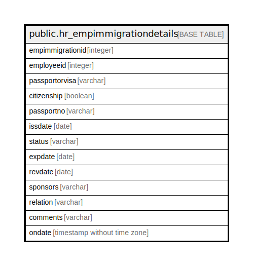

# public.hr_empimmigrationdetails

## Description

## Columns

| Name | Type | Default | Nullable | Children | Parents | Comment |
| ---- | ---- | ------- | -------- | -------- | ------- | ------- |
| empimmigrationid | integer | nextval('hr_empimmigrationdetails_empimmigrationid_seq'::regclass) | false |  |  |  |
| employeeid | integer |  | true |  |  |  |
| passportorvisa | varchar |  | true |  |  |  |
| citizenship | boolean |  | true |  |  |  |
| passportno | varchar |  | true |  |  |  |
| issdate | date |  | true |  |  |  |
| status | varchar |  | true |  |  |  |
| expdate | date |  | true |  |  |  |
| revdate | date |  | true |  |  |  |
| sponsors | varchar |  | true |  |  |  |
| relation | varchar |  | true |  |  |  |
| comments | varchar |  | true |  |  |  |
| ondate | timestamp without time zone | now() | true |  |  |  |

## Constraints

| Name | Type | Definition |
| ---- | ---- | ---------- |
| hr_empimmigrationdetails_pkey | PRIMARY KEY | PRIMARY KEY (empimmigrationid) |

## Indexes

| Name | Definition |
| ---- | ---------- |
| hr_empimmigrationdetails_pkey | CREATE UNIQUE INDEX hr_empimmigrationdetails_pkey ON public.hr_empimmigrationdetails USING btree (empimmigrationid) |

## Relations

---

> Generated by [tbls](https://github.com/k1LoW/tbls)
