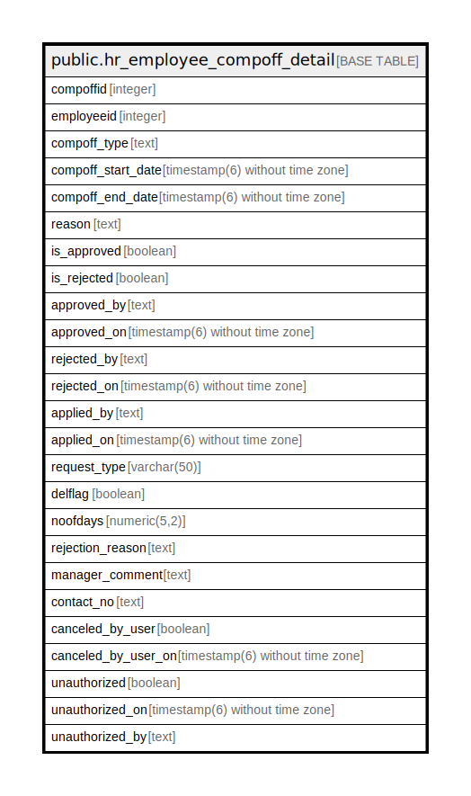

# public.hr_employee_compoff_detail

## Description

## Columns

| Name | Type | Default | Nullable | Children | Parents | Comment |
| ---- | ---- | ------- | -------- | -------- | ------- | ------- |
| compoffid | integer | nextval('hr_employee_compoff_detail_compoffid_seq'::regclass) | false |  |  |  |
| employeeid | integer |  | true |  |  |  |
| compoff_type | text |  | true |  |  |  |
| compoff_start_date | timestamp(6) without time zone |  | true |  |  |  |
| compoff_end_date | timestamp(6) without time zone |  | true |  |  |  |
| reason | text |  | true |  |  |  |
| is_approved | boolean |  | true |  |  |  |
| is_rejected | boolean |  | true |  |  |  |
| approved_by | text |  | true |  |  |  |
| approved_on | timestamp(6) without time zone |  | true |  |  |  |
| rejected_by | text |  | true |  |  |  |
| rejected_on | timestamp(6) without time zone |  | true |  |  |  |
| applied_by | text |  | true |  |  |  |
| applied_on | timestamp(6) without time zone |  | true |  |  |  |
| request_type | varchar(50) |  | true |  |  |  |
| delflag | boolean |  | true |  |  |  |
| noofdays | numeric(5,2) |  | true |  |  |  |
| rejection_reason | text |  | true |  |  |  |
| manager_comment | text |  | true |  |  |  |
| contact_no | text |  | true |  |  |  |
| canceled_by_user | boolean |  | true |  |  |  |
| canceled_by_user_on | timestamp(6) without time zone |  | true |  |  |  |
| unauthorized | boolean |  | true |  |  |  |
| unauthorized_on | timestamp(6) without time zone |  | true |  |  |  |
| unauthorized_by | text |  | true |  |  |  |

## Relations

---

> Generated by [tbls](https://github.com/k1LoW/tbls)
