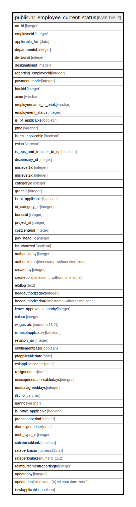

# public.hr_employee_current_status

## Description

## Columns

| Name | Type | Default | Nullable | Children | Parents | Comment |
| ---- | ---- | ------- | -------- | -------- | ------- | ------- |
| un_id | integer | nextval('hr_employee_current_status_un_id_seq'::regclass) | false |  |  |  |
| employeeid | integer |  | false |  |  |  |
| applicable_frm | date |  | false |  |  |  |
| departmentid | integer |  | true |  |  |  |
| divisionid | integer |  | true |  |  |  |
| designationid | integer |  | true |  |  |  |
| reporting_employeeid | integer |  | true |  |  |  |
| payment_mode | integer |  | true |  |  |  |
| bankid | integer |  | true |  |  |  |
| acno | varchar |  | true |  |  |  |
| employeename_in_bank | varchar |  | true |  |  |  |
| employment_status | integer |  | true |  |  |  |
| is_pf_applicable | boolean | false | true |  |  |  |
| pfno | varchar |  | true |  |  |  |
| is_esi_applicable | boolean | false | true |  |  |  |
| esino | varchar |  | true |  |  |  |
| is_eps_amt_transfer_to_epf | boolean |  | true |  |  |  |
| dispensary_id | integer |  | true |  |  |  |
| mislevel1id | integer |  | true |  |  |  |
| mislevel2id | integer |  | true |  |  |  |
| categoryid | integer |  | true |  |  |  |
| gradeid | integer |  | true |  |  |  |
| is_ot_applicable | boolean | false | true |  |  |  |
| ot_category_id | integer |  | true |  |  |  |
| bonusid | integer |  | true |  |  |  |
| project_id | integer |  | true |  |  |  |
| costcenterid | integer |  | true |  |  |  |
| pay_head_id | integer |  | true |  |  |  |
| isauthorized | boolean | false | false |  |  |  |
| authorizedby | integer |  | true |  |  |  |
| authorizedon | timestamp without time zone |  | true |  |  |  |
| createdby | integer |  | true |  |  |  |
| createdon | timestamp without time zone | now() | true |  |  |  |
| editlog | text |  | true |  |  |  |
| headauthorizedby | integer |  | true |  |  |  |
| headauthorizedon | timestamp without time zone |  | true |  |  |  |
| leave_approval_authority | integer |  | true |  |  |  |
| colour | integer |  | true |  |  |  |
| wagesrate | numeric(18,2) |  | true |  |  |  |
| ismaxpfapplicable | boolean |  | true |  |  |  |
| revision_no | integer |  | true |  |  |  |
| entitlementbasis | boolean |  | true |  |  |  |
| pfapplicabledate | date |  | true |  |  |  |
| esiapplicabledate | date |  | true |  |  |  |
| resigneddate | date |  | true |  |  |  |
| noticeperiodapplicabledays | integer |  | true |  |  |  |
| mutualagreeddays | integer |  | true |  |  |  |
| ifscno | varchar |  | true |  |  |  |
| uanno | varchar |  | true |  |  |  |
| is_pttax_applicable | boolean | true | true |  |  |  |
| probationperiod | integer |  | true |  |  |  |
| datresigneddate | date |  | true |  |  |  |
| mob_type_id | integer |  | true |  |  |  |
| setimeinoblank | boolean |  | true |  |  |  |
| rateperkmcar | numeric(15,2) | 0.0 | false |  |  |  |
| rateperkmbike | numeric(15,2) | 0.0 | false |  |  |  |
| reimbursementreportingto | integer |  | true |  |  |  |
| updatedby | integer |  | true |  |  |  |
| updatedon | timestamp(6) without time zone | NULL::timestamp without time zone | true |  |  |  |

## Constraints

| Name | Type | Definition |
| ---- | ---- | ---------- |
| hr_employee_current_status_pkey | PRIMARY KEY | PRIMARY KEY (un_id) |

## Indexes

| Name | Definition |
| ---- | ---------- |
| hr_employee_current_status_pkey | CREATE UNIQUE INDEX hr_employee_current_status_pkey ON public.hr_employee_current_status USING btree (un_id) |

## Relations

---

> Generated by [tbls](https://github.com/k1LoW/tbls)
