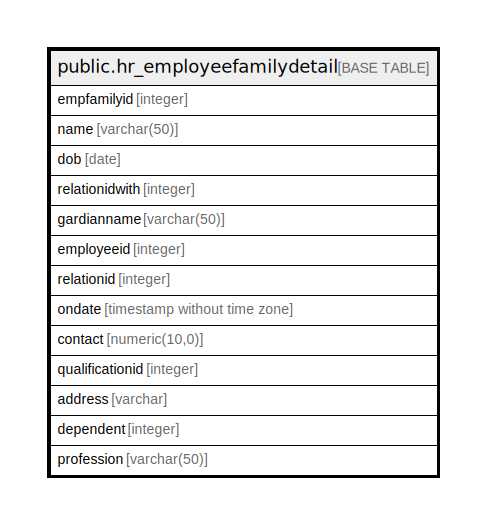

# public.hr_employeefamilydetail

## Description

## Columns

| Name | Type | Default | Nullable | Children | Parents | Comment |
| ---- | ---- | ------- | -------- | -------- | ------- | ------- |
| empfamilyid | integer | nextval('hr_employeefamilydetail_empfamilyid_seq'::regclass) | false |  |  |  |
| name | varchar(50) |  | true |  |  |  |
| dob | date |  | true |  |  |  |
| relationidwith | integer |  | true |  |  |  |
| gardianname | varchar(50) |  | true |  |  |  |
| employeeid | integer |  | true |  |  |  |
| relationid | integer |  | true |  |  |  |
| ondate | timestamp without time zone | now() | true |  |  |  |
| contact | numeric(10,0) |  | true |  |  |  |
| qualificationid | integer |  | true |  |  |  |
| address | varchar |  | true |  |  |  |
| dependent | integer |  | true |  |  |  |
| profession | varchar(50) |  | true |  |  |  |

## Constraints

| Name | Type | Definition |
| ---- | ---- | ---------- |
| employeefamilydetail_pkey | PRIMARY KEY | PRIMARY KEY (empfamilyid) |

## Indexes

| Name | Definition |
| ---- | ---------- |
| employeefamilydetail_pkey | CREATE UNIQUE INDEX employeefamilydetail_pkey ON public.hr_employeefamilydetail USING btree (empfamilyid) |

## Relations

---

> Generated by [tbls](https://github.com/k1LoW/tbls)
