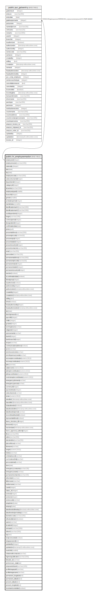

# public.hr_employeemaster

## Description

## Columns

| Name | Type | Default | Nullable | Children | Parents | Comment |
| ---- | ---- | ------- | -------- | -------- | ------- | ------- |
| employeeid | integer | nextval('hr_employeemaster_employeeid_seq'::regclass) | false | [public.pur_gateentry](public.pur_gateentry.md) |  |  |
| employeename | varchar(100) |  | true |  |  |  |
| nationality | integer |  | true |  |  |  |
| dob | date |  | true |  |  |  |
| doj | date |  | true |  |  |  |
| employeecode | varchar(100) |  | true |  |  |  |
| salarystructureid | integer |  | true |  |  |  |
| departmentid | integer |  | true |  |  |  |
| categoryid | integer |  | true |  |  |  |
| idcardno | varchar(100) |  | true |  |  |  |
| employeetypeid | smallint |  | true |  |  |  |
| branchid | integer |  | true |  |  |  |
| gender | smallint | 1 | true |  |  |  |
| probationperiod | integer |  | true |  |  |  |
| maritalstatus | smallint | 1 | true |  |  |  |
| identificationmark1 | varchar(100) |  | true |  |  |  |
| identificationmark2 | varchar(100) |  | true |  |  |  |
| noofdependents | integer |  | true |  |  |  |
| height | varchar(100) |  | true |  |  |  |
| contractperiod | integer |  | true |  |  |  |
| designationid | integer |  | true |  |  |  |
| confirmationdate | date |  | true |  |  |  |
| photo | path |  | true |  |  |  |
| presentaddress | varchar(200) |  | true |  |  |  |
| presentpincode | varchar(6) |  | true |  |  |  |
| presentcityid | integer |  | true |  |  |  |
| presentstateid | integer |  | true |  |  |  |
| presentcountryid | integer |  | true |  |  |  |
| presentcontactno | varchar(30) |  | true |  |  |  |
| email | varchar(50) |  | true |  |  |  |
| pannumber | varchar(15) |  | true |  |  |  |
| permanentaddress | varchar(200) |  | true |  |  |  |
| permanentpincode | varchar(6) |  | true |  |  |  |
| permanentcityid | integer |  | true |  |  |  |
| permanentstateid | integer |  | true |  |  |  |
| permanentcountryid | integer |  | true |  |  |  |
| isactive | boolean | true | false |  |  |  |
| isconfirmationdate | boolean |  | true |  |  |  |
| bloodgroup | integer |  | true |  |  |  |
| isauthorized | boolean | false | false |  |  |  |
| authorizedby | integer |  | true |  |  |  |
| authorizedon | timestamp without time zone |  | true |  |  |  |
| createdby | integer |  | true |  |  |  |
| createdon | timestamp without time zone | now() | true |  |  |  |
| editlog | text |  | true |  |  |  |
| ishod | boolean | false | true |  |  |  |
| headauthorizedby | integer |  | true |  |  |  |
| headauthorizedon | timestamp without time zone |  | true |  |  |  |
| dol | date |  | true |  |  | Date Of Leaving |
| leavingreason | text |  | true |  |  |  |
| payrollid | integer |  | true |  |  |  |
| shiftid | integer |  | true |  |  |  |
| gradeid | integer |  | true |  |  |  |
| workinghours | varchar |  | true |  |  |  |
| religionid | integer |  | true |  |  |  |
| spousename | varchar |  | true |  |  |  |
| bankid | integer |  | true |  |  |  |
| bankbranchid | integer |  | true |  |  |  |
| actype | varchar |  | true |  |  |  |
| communicationaddress | boolean |  | true |  |  |  |
| acno | varchar |  | true |  |  |  |
| esicinsuranceno | varchar |  | true |  |  |  |
| esicdispensaryname | varchar |  | true |  |  |  |
| esicemplorcontribution | numeric(18,2) |  | true |  |  |  |
| esicempcontribution | numeric(18,2) |  | true |  |  |  |
| pfno | varchar |  | true |  |  |  |
| vpfpercent | numeric(18,2) |  | true |  |  |  |
| pfemplorcontribution | numeric(18,2) |  | true |  |  |  |
| pfempcontribution | numeric(18,2) |  | true |  |  |  |
| restrictemplorcontribution | numeric(18,2) |  | true |  |  |  |
| emergencyphoneno | varchar |  | true |  |  |  |
| emergencyperson | varchar |  | true |  |  |  |
| currencyid | integer |  | true |  |  |  |
| paymentmode | varchar |  | true |  |  |  |
| salarybasison | varchar |  | true |  |  |  |
| otrate | numeric(18,2) |  | true |  |  |  |
| minotlimit | timestamp without time zone |  | true |  |  |  |
| maxotlimit | timestamp without time zone |  | true |  |  |  |
| islateallowded | boolean |  | true |  |  |  |
| lateallowdedtime | timestamp without time zone |  | true |  |  |  |
| lateallowdedperiod | varchar |  | true |  |  |  |
| isovertimeallowded | boolean |  | true |  |  |  |
| ispresentaddress | boolean |  | true |  |  |  |
| leave_structure_id | integer |  | true |  |  |  |
| divisionid | integer |  | true |  |  |  |
| inactivedate | timestamp without time zone |  | true |  |  |  |
| leave_approval_authority | integer |  | true |  |  |  |
| ifsno | varchar(50) |  | true |  |  |  |
| uidno | varchar(50) |  | true |  |  |  |
| electionidno | varchar(50) |  | true |  |  |  |
| placeofissue | varchar |  | true |  |  |  |
| diseases | varchar |  | true |  |  |  |
| weight | numeric(18,2) |  | true |  |  |  |
| hobies | varchar |  | true |  |  |  |
| criminalrecord | varchar |  | true |  |  |  |
| curricularactivity | varchar |  | true |  |  |  |
| personalemail | varchar |  | true |  |  |  |
| dom | date |  | true |  |  |  |
| emergencycontactno | varchar(18) |  | true |  |  |  |
| emergencyname | varchar |  | true |  |  |  |
| permanentcontactno | varchar(18) |  | true |  |  |  |
| otherdetail | varchar |  | true |  |  |  |
| fathername | varchar |  | true |  |  |  |
| mothername | varchar |  | true |  |  |  |
| castid | integer |  | true |  |  |  |
| status_id | integer |  | true |  |  |  |
| seriesid | integer |  | true |  |  |  |
| seriesno | integer |  | true |  |  |  |
| seriescode | varchar |  | true |  |  |  |
| empphoto | bytea |  | true |  |  |  |
| empsig | bytea |  | true |  |  |  |
| lateallowdedtimedep | timestamp without time zone |  | true |  |  |  |
| lateallowdedperioddep | varchar |  | true |  |  |  |
| biometriccode | varchar(100) |  | true |  |  |  |
| isfinalsettlement | boolean |  | true |  |  |  |
| uanno | varchar |  | true |  |  |  |
| locationid | integer |  | true |  |  |  |
| emirateid | varchar(200) | ''::character varying | true |  |  |  |
| otherid | varchar(200) | ''::character varying | true |  |  |  |
| otp | text |  | true |  |  |  |
| isotpconsumed | boolean |  | true |  |  |  |
| emppassword | text |  | true |  |  |  |
| updatedby | integer |  | true |  |  |  |
| updatedon | timestamp(6) without time zone | NULL::timestamp without time zone | true |  |  |  |
| noofchild | smallint |  | true |  |  |  |
| relationwithcontactor | varchar |  | true |  |  |  |
| highestqualification | varchar(100) |  | true |  |  |  |
| linkedin_id | varchar |  | true |  |  |  |
| anniversary_date | date |  | true |  |  |  |
| empnameinbank | varchar(100) |  | true |  |  |  |
| profileimagepath | varchar |  | true |  |  |  |
| profileimagename | varchar |  | true |  |  |  |
| permanent_longitude | text |  | true |  |  |  |
| permanent_latitude | text |  | true |  |  |  |
| present_latitude | text |  | true |  |  |  |
| present_longitude | text |  | true |  |  |  |
| issentwelcomeletter | boolean | false | true |  |  |  |

## Constraints

| Name | Type | Definition |
| ---- | ---- | ---------- |
| employeemaster_employeename_ke | UNIQUE | UNIQUE (employeecode) |
| employeemaster_pkey | PRIMARY KEY | PRIMARY KEY (employeeid) |

## Indexes

| Name | Definition |
| ---- | ---------- |
| employeemaster_employeename_ke | CREATE UNIQUE INDEX employeemaster_employeename_ke ON public.hr_employeemaster USING btree (employeecode) |
| employeemaster_pkey | CREATE UNIQUE INDEX employeemaster_pkey ON public.hr_employeemaster USING btree (employeeid) |

## Relations

---

> Generated by [tbls](https://github.com/k1LoW/tbls)
