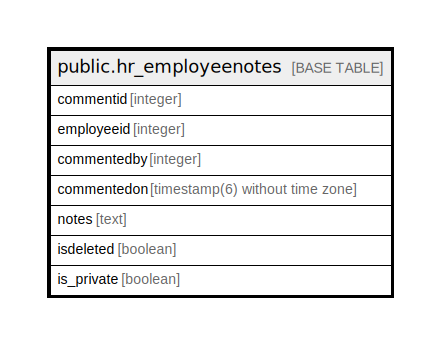

# public.hr_employeenotes

## Description

## Columns

| Name | Type | Default | Nullable | Children | Parents | Comment |
| ---- | ---- | ------- | -------- | -------- | ------- | ------- |
| commentid | integer | nextval('hr_employeenotes_commentid_seq'::regclass) | false |  |  |  |
| employeeid | integer |  | true |  |  |  |
| commentedby | integer |  | true |  |  |  |
| commentedon | timestamp(6) without time zone | now() | true |  |  |  |
| notes | text |  | true |  |  |  |
| isdeleted | boolean | false | true |  |  |  |
| is_private | boolean | false | true |  |  |  |

## Relations

---

> Generated by [tbls](https://github.com/k1LoW/tbls)
