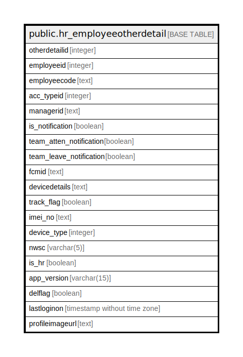

# public.hr_employeeotherdetail

## Description

## Columns

| Name | Type | Default | Nullable | Children | Parents | Comment |
| ---- | ---- | ------- | -------- | -------- | ------- | ------- |
| otherdetailid | integer | nextval('hr_employeeotherdetail_otherdetailid_seq'::regclass) | false |  |  |  |
| employeeid | integer |  | true |  |  |  |
| employeecode | text |  | true |  |  |  |
| acc_typeid | integer |  | true |  |  |  |
| managerid | text |  | true |  |  |  |
| is_notification | boolean |  | true |  |  |  |
| team_atten_notification | boolean |  | true |  |  |  |
| team_leave_notification | boolean |  | true |  |  |  |
| fcmid | text |  | true |  |  |  |
| devicedetails | text |  | true |  |  |  |
| track_flag | boolean |  | true |  |  |  |
| imei_no | text |  | true |  |  |  |
| device_type | integer |  | true |  |  |  |
| nwsc | varchar(5) |  | true |  |  |  |
| is_hr | boolean |  | true |  |  |  |
| app_version | varchar(15) |  | true |  |  |  |
| delflag | boolean |  | true |  |  |  |
| lastloginon | timestamp without time zone |  | true |  |  |  |
| profileimageurl | text |  | true |  |  |  |

## Relations

---

> Generated by [tbls](https://github.com/k1LoW/tbls)
